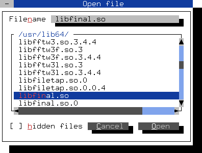
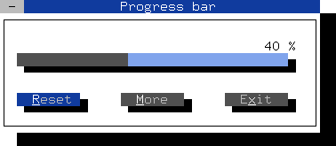
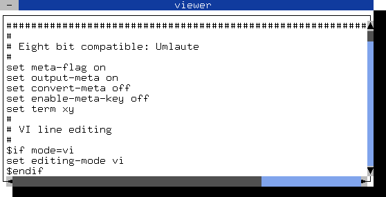
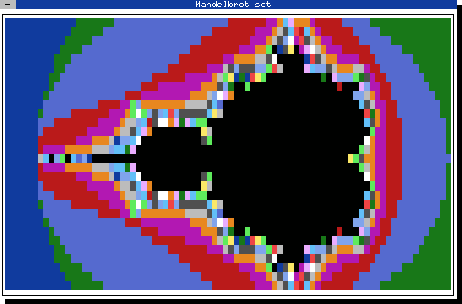
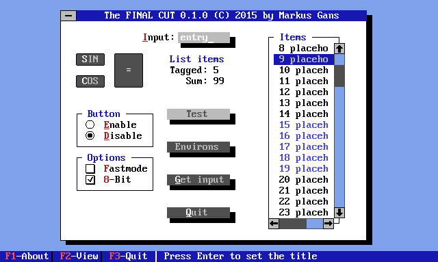
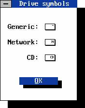
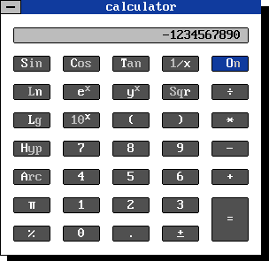

============================================

### Building and code analysis
*Latest release:*<br />
&#160;&#160;&#160;&#160;&#160;[](https://github.com/gansm/finalcut/releases) <br />
*Travis CI:*<br />
&#160;&#160;&#160;&#160;&#160;[](https://travis-ci.org/gansm/finalcut) <br />
*Coverity Scan:*<br />
&#160;&#160;&#160;&#160;&#160;[](https://scan.coverity.com/projects/6508) <br />
*LGTM:*<br />
&#160;&#160;&#160;&#160;&#160;[](https://lgtm.com/projects/g/gansm/finalcut/context:cpp) <br />
*Class Reference:*<br />
&#160;&#160;&#160;&#160;&#160;[](https://codedocs.xyz/gansm/finalcut/hierarchy.html)

### Description
The FINAL CUT is a C++ class library and widget toolkit with full mouse support for creating a [text-based user interface](https://en.wikipedia.org/wiki/Text-based_user_interface). The library supports the programmer to develop an application for the text console. It allows the simultaneous handling of multiple text windows on the screen.

The structure of the Qt framework was originally the inspiration for the C++ class design of FINAL CUT. It provides common controls like dialog boxes, push buttons, check boxes, radio buttons, input lines, list boxes, status bars and so on.

### Installation
```bash
> git clone git://github.com/gansm/finalcut.git
> cd finalcut
> autoreconf --install --force
> ./configure --prefix=/usr
> make
> su -c "make install"
```

### Supported platforms
* Linux
* FreeBSD
* NetBSD
* OpenBSD
* macOS
* Cygwin
* Solaris

### First steps

[How to use the library](doc/first-steps.md#first-steps-with-the-final-cut-widget-toolkit)

### Screenshots

The FFileDialog widget:




The Final Cut FProgressbar widget:




Scrollable text in the FTextView widget:

 


The Mandelbrot set example:

 


newfont
-------
A [graphical text font](fonts/) for X11 and the Linux console.




Newfont drive symbols:




The calculator example in newfont mode:




Virtual terminal
----------------
It uses a virtual terminal to print the character via an update method on the screen.
The virtual windows are an overlying layer to realizing window movements.
The update method transmits only the changes to the virtual terminal or the screen.

<pre style="line-height: 1 !important;">
 print(...)
printf(...)
  │
  │           ╔═════════════════════════[ vterm ]═════════════════════════╗
  │           ║createVTerm()                                              ║
  │           ║                                 ┌ ─ ─ ─ ─ ─ ─ ─ ─ ─ ─ ─ ┐ ║
  │           ║                                                           ║
  │           ║                                 │ restoreVTerm(x,y,w,h) │ ║
  │           ║                                                           ║
  │           ║                                 └ ─ ─ ─ ─ ─ ─ ─ ─ ─ ─ ─ ┘ ║
  │           ║                                                           ║
  │   ┌───────╨─────[ vwin ]─────────────┐                                ║
  │   │createArea(area)                  │                                ║
  │   │                                  │                                ║
  │   │                                  │                                ║
  └───┼─────────────►     ──────► updateVTerm(area) ────►                 ║
      │                                  │                                ║
      │                           putArea(x,y,area)                       ║
      │                         ────────────────────►                     ║
      │                           getArea(x,y,area)                       ║
      │                        ◄────────────────────                      ║
      │                                  │                                ║
      │                                  │                                ║
      │                  resizeArea(area)│                                ║
      └───────╥──────────────────────────┘                                ║
              ║                                                           ║
              ║                                                           ║
              ║                                                           ║
              ║   │                                          resizeVTerm()║
              ╚═══▼═══════════════════════════════════════════════════════╝
                  │
                  │    putVTerm()
                  └──────────────────► updateTerminalLine(y)
                    updateTerminal()             │
                                                 ▼
                                         ┌───────────────┐
                                         │ output_buffer │
                                         └───────────────┘
                                                 │
                                                 │ flush_out()
                                                 │     +
                                                 │ Fputchar(char)
                                                 │
                                                 ▼
                                         ▄▄▄▄▄▄▄▄▄▄▄▄▄▄▄▄▄
                                         ▌               ▐
                                         ▌    screen     ▐
                                         ▌ ───────────── ▐
                                         ▌ real terminal ▐
                                         ▌               ▐
                                         ▀▀▀▀▀▀▀███▀▀▀▀▀▀▀
                                                ███
                                             ▀▀▀▀▀▀▀▀▀
</pre>


Class digramm
-------------

<pre style="line-height: 1 !important;">
              1┌──────────────┐
   ┌-----------┤ FTermFreeBSD │
   :           └──────────────┘
   :          1┌──────────────┐         ┌───────────┐
   ┌-----------┤ FTermOpenBSD │    ┌────┤ FKeyEvent │
   :           └──────────────┘    │    └───────────┘
   :          1┌────────────────┐  │    ┌─────────────┐
   ┌-----------┤ FTermDetection │  ├────┤ FMouseEvent │
   :           └────────────────┘  │    └─────────────┘
   :          1┌────────────────┐  │    ┌─────────────┐
   ┌-----------┤ FTermcapQuirks │  ├────┤ FWheelEvent │
   :           └────────────────┘  │    └─────────────┘
   :          1┌────────────────┐  │    ┌─────────────┐
   ┌-----------┤ FTermXTerminal │  ├────┤ FFocusEvent │
   :           └────────────────┘  │    └─────────────┘
   :          1┌──────────┐        │    ┌─────────────┐
   ┌-----------┤ FTermcap │        ├────┤ FAccelEvent │
   :           └──────────┘        │    └─────────────┘
   :          1┌──────────┐        │    ┌──────────────┐
   ┌-----------┤ FTermios │        ├────┤ FResizeEvent │
   :           └──────────┘        │    └──────────────┘
   :          1┌───────────────┐   │    ┌────────────┐
   ┌-----------┤ FColorPalette │   ├────┤ FShowEvent │
   :           └───────────────┘   │    └────────────┘
   :          1┌───────────┐       │    ┌────────────┐
   ┌-----------┤ FOptiMove │       ├────┤ FHideEvent │
   :           └───────────┘       │    └────────────┘
   :          1┌───────────┐       │    ┌─────────────┐
   ┌-----------┤ FOptiAttr │       ├────┤ FCloseEvent │
   :           └───────────┘       │    └─────────────┘
   :          1┌───────────┐       │    ┌─────────────┐
   ┌-----------┤ FKeyboard │       ├────┤ FTimerEvent │
   :           └───────────┘       │    └─────────────┘
   :          1┌───────────────┐   │
   ┌-----------┤ FMouseControl │   │       ┌──────────────┐
   :           └───────────────┘   │  ┌────┤ FApplication │
   :          *┌─────────┐         │  │    └──────────────┘
   :  ┌--------┤ FString │         │  │    ┌─────────┐
   :  :        └─────────┘         │  ├────┤ FButton │
   :  :       *┌────────┐          │  │    └─────────┘
   :  ┌--------┤ FPoint │          │  │    ┌────────┐
   :  :        └────────┘          │  ├────┤ FLabel │
   :  :       *┌───────┐           │  │    └────────┘
   :  ┌--------┤ FRect │           │  │    ┌───────────┐
   :  :        └───────┘           │  ├────┤ FLineEdit │
   :1 :1                           │  │    └───────────┘
 ┌─┴──┴──┐                         │  │    ┌──────────────┐      ┌──────────────┐
 │ FTerm │                         │  ├────┤ FButtonGroup │   ┌──┤ FRadioButton │
 └───┬───┘         ┌────────┐      │  │    └──────────────┘   │  └──────────────┘
     :1            │ FEvent │◄─────┘  │    ┌───────────────┐  │  ┌───────────┐
 ┌───┴────┐        └────┬───┘         ├────┤ FToggleButton │◄─┼──┤ FCheckBox │
 │ FVTerm │◄──┐         :1            │    └───────────────┘  │  └───────────┘
 └────────┘   │    ┌────┴────┐        │    ┌──────────────┐   │  ┌─────────┐
              ├────┤ FWidget │◄───────┼────┤ FProgressbar │   └──┤ FSwitch │
┌─────────┐   │    └─────────┘        │    └──────────────┘      └─────────┘
│ FObject │◄──┘                       │    ┌────────────┐
└─────────┘                           ├────┤ FScrollbar │
                                      │    └────────────┘
                                      │    ┌───────────┐
                                      ├────┤ FTextView │
                                      │    └───────────┘
                                      │    ┌──────────┐1     *┌──────────────┐
                                      ├────┤ FListBox ├-------┤ FListBoxItem │
                                      │    └──────────┘       └──────────────┘
 ┌─────────────┐1                     │   1┌───────────┐1    *┌───────────────┐
 │ FTermBuffer ├----------------------├────┤ FListView ├------┤ FListViewItem │
 └─────────────┘                      │    └───────────┘      └───────────────┘
                                      │    ┌─────────────┐
                                      ├────┤ FScrollView │
                                      │    └─────────────┘
                                      │    ┌────────────┐1   *┌────────────┐
                                      │ ┌──┤ FStatusBar ├-----┤ FStatusKey │
                                      │ │  └────────────┘     └────────────┘
                                      │ │
                                      │ ▼                       ┌─────────────┐
                                  ┌───┴─┴───┐  ┌─────────┐   ┌──┤ FFileDialog │
                                  │ FWindow │◄─┤ FDialog │◄──┤  └─────────────┘
                                  └──┬──┬───┘  └─────────┘   │  ┌─────────────┐
                                     ▲  ▲                    └──┤ FMessageBox │
                                     │  │                       └─────────────┘
                                     │  │      ┌──────────┐
                                     │  └──────┤ FToolTip │
                                     │         └──────────┘
                                     └───────────────┐          ┌──────────┐
                                                     │      ┌───┤ FMenuBar │
                                    ┌───────────┐    └──────┤   └──────────┘
                                    │ FMenuList │◄──────────┤   ┌───────┐
                                    └────┬──────┘           └───┤ FMenu │◄──┐
                                         :1                     └───────┘   │
                                         :            ┌─────────────────┐   │
                                         :            │ FDialogListMenu ├───┘
                                         :            └─────────────────┘
                                         └--------------------------------┐
                                         :*          ┌────────────────┐*  :
                                    ┌────┴─────┐  ┌──┤ FCheckMenuItem ├---┘
                                    │FMenuItem │◄─┤  └────────────────┘   :
                                    └──────────┘  │  ┌────────────────┐*  :
                                                  └──┤ FRadioMenuItem ├---┘
                                                     └────────────────┘
</pre>

License
-------
GNU Lesser General Public License Version 3

Frequently Asked Questions
--------------------------
If you have any problems, please read the
[FAQ](doc/faq.md#frequently-asked-questions)
before you give up.

Please send bug reports to
--------------------------
https://github.com/gansm/finalcut/issues

