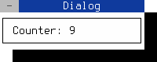
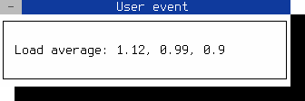

Event Processing
================

Table of Contents
-----------------

<!-- TOC -->
- [Event handling](#how-events-are-processed)
- [Event handler reimplementation](#event-handler-reimplementation)
- [Event types](#available-event-types)
- [Timer event](#using-a-timer-event)
- [User event](#using-a-user-event)
<!-- /TOC -->


How events are processed
------------------------

Calling `FApplication::exec()` starts the FINAL CUT main event loop. 
While the event loop is running, the system checks all the time whether 
an event has occurred and sends it to the application's currently focused 
object. The events of the terminal, such as keystrokes, mouse actions, or 
terminal size changing, are translated into `FEvent` objects, and are sent to 
the active `FObject`. It is also possible to use `FApplication::sendEvent()` 
or `FApplication::queueEvent()` to send a specific event to an object.

`FObject`-derived objects process incoming events by reimplementing the 
virtual method `event()`. The `FObject` itself can only call its own events 
`onTimer()` and `onUserEvent()` and ignores all other events. The 
`FObject`-derived class `FWidget` also reimplements the `event()` method 
to handle further events. `FWidget` calls the `FWidget::onKeyPress` method
when you press a key, or the `FWidget::onMouseDown` method when you click 
a mouse button.


Event handler reimplementation
------------------------------

An event in FINAL CUT is an object that inherits from the base class 
`FEvent`. There are several event types, represented by an enum value. 
For example, the method `FEvent::type()` returns the type 
`Event::MouseDown` when you press down a mouse button. 

Some event types have data that cannot be stored in an `FEvent` object. 
For example, a click event of the mouse requires to store which button was 
triggered and the position of the mouse pointer at that time. In classes
derived  from `FEvent`, such as `FMouseEvent()`, we store this data.

Widgets get their events from the `event()` method inherited from `FObject`. 
The implementation of `event()` in `FWidget` forwards the most common event 
types to specific event handlers such as `FMouseEvent()`, `FKeyEvent()` or 
`FResizeEvent()`. There are many other event types. You can create your own
event types and send them to other objects and widgets.


Available event types
---------------------

```cpp
enum class Event
{
  None,              // invalid event
  KeyPress,          // key pressed
  KeyUp,             // key released
  KeyDown,           // key pressed
  MouseDown,         // mouse button pressed
  MouseUp,           // mouse button released
  MouseDoubleClick,  // mouse button double click
  MouseWheel,        // mouse wheel rolled
  MouseMove,         // mouse move
  FocusIn,           // focus in
  FocusOut,          // focus out
  ChildFocusIn,      // child focus in
  ChildFocusOut,     // child focus out
  FailAtChildFocus,  // No further focusable child widgets
  TerminalFocusIn,   // terminal focus in
  TerminalFocusOut,  // terminal focus out
  WindowActive,      // activate window
  WindowInactive,    // deactivate window
  WindowRaised,      // raise window
  WindowLowered,     // lower window
  Accelerator,       // keyboard accelerator
  Resize,            // terminal resize
  Show,              // widget is shown
  Hide,              // widget is hidden
  Close,             // widget close
  Timer,             // timer event occur
  User               // user defined event
};
```


Using a timer event
-------------------

The following example starts a periodic timer that triggers an `FTimerEvent()` 
every 100 ms. The virtual method `onTimer()` is then called each time in the 
same dialog object.

**File:** *timer.cpp*
```cpp
#include <final/final.h>

using namespace finalcut;

class dialogWidget : public FDialog
{
  public:
    explicit dialogWidget (FWidget* parent = nullptr)
      : FDialog{parent}
    {
      label.setAlignment (Align::Right);
      id = addTimer(100);
    }

  private:
    void initLayout()
    {
      setText ("Dialog");
      setGeometry (FPoint{25, 5}, FSize{23, 4});
      label.setGeometry (FPoint{1, 1}, FSize{10, 1});
      value.setGeometry (FPoint{11, 1}, FSize{10, 1});
      FDialog::initLayout();
    }

    void onTimer (FTimerEvent* ev) override
    {
      if ( id == ev->getTimerId() && n < 9999999999 )
      {
        value.setNumber(n);
        value.redraw();
        n++;
      }
    }

    FLabel label{"Counter: ", this};
    FLabel value{"0", this};
    long n{0};
    int id{0};
};

auto main (int argc, char* argv[]) -> int
{
  FApplication app(argc, argv);
  dialogWidget dialog(&app);
  FWidget::setMainWidget(&dialog);
  dialog.show();
  return app.exec();
}
```
<figure class="image">
  
  <figcaption>Figure 5.  FObject::onTimer event handler</figcaption>
</figure>
<br /><br />

> [!NOTE]
> You can close the dialog with the mouse, 
> <kbd>Shift</kbd>+<kbd>F10</kbd> or <kbd>Ctrl</kbd>+<kbd>^</kbd>


After entering the source code in *timer.cpp* you can compile
the above program with gcc:
```bash
g++ timer.cpp -o timer -O2 -lfinal -std=c++14
```


Using a user event
------------------

You can use the `FUserEvent()` to create a individual event and send it to a 
specific object. If you want to create more than one user event, you can 
specify an identification number (0 in the example below) to identify the 
different events. Afterwards this number can be retrieved with `getUserId()`.

User events should be generated in the main event loop. For this purpose, 
the class `FApplication` provides the virtual method 
`processExternalUserEvent()`. This method can be overwritten in a derived 
class and filled with user code.

The following example reads the average system load and creates a user event 
when a value changes. This event sends the current values to an `FLabel` 
widget and displays them in the terminal.


**File:** *user-event.cpp*
```cpp
#include <stdlib.h>
#include <final/final.h>
#define _BSD_SOURCE 1
#define _DEFAULT_SOURCE 1

using LoadAvg = double[3];
using namespace finalcut;

class extendedApplication : public FApplication
{
  public:
    extendedApplication (const int& argc, char* argv[])
      : FApplication(argc, argv)
    { }

  private:
    void processExternalUserEvent() override
    {
      if ( getMainWidget() )
      {
        if ( getloadavg(load_avg, 3) < 0 )
          FApplication::getLog()->error("Can't get load average values");

        if ( last_avg[0] != load_avg[0]
          || last_avg[1] != load_avg[1]
          || last_avg[2] != load_avg[2] )
        {
          FUserEvent user_event(Event::User, 0);
          user_event.setData (load_avg);
          FApplication::sendEvent (getMainWidget(), &user_event);
        }

        for (std::size_t i = 0; i < 3; i++)
          last_avg[i] = load_avg[i];
      }
    }

    // Data member
    LoadAvg load_avg{}, last_avg{};
};


class dialogWidget final : public FDialog
{
  public:
    explicit dialogWidget (FWidget* parent = nullptr)
      : FDialog{"User event", parent}
    { }

  private:
    void initLayout()
    {
      FDialog::setGeometry (FPoint{25, 5}, FSize{40, 6});
      loadavg_label.setGeometry (FPoint{2, 2}, FSize{36, 1});
      FDialog::initLayout();
    }

    void onUserEvent (FUserEvent* ev) override
    {
      const auto& lavg = ev->getData<LoadAvg>();
      std::setlocale(LC_NUMERIC, "C");
      loadavg_label.clear();
      loadavg_label << "Load average: " << lavg[0] << ", "
                                        << lavg[1] << ", "
                                        << lavg[2] << " ";
      loadavg_label.redraw();
    }

    FLabel loadavg_label{this};
};

auto main (int argc, char* argv[]) -> int
{
  extendedApplication app(argc, argv);
  dialogWidget dialog(&app);
  FWidget::setMainWidget(&dialog);
  dialog.show();
  return app.exec();
}
```
<figure class="image">
  
  <figcaption>Figure 6.  User event generation</figcaption>
</figure>
<br /><br />

> [!NOTE]
> You can close the dialog with the mouse, 
> <kbd>Shift</kbd>+<kbd>F10</kbd> or <kbd>Ctrl</kbd>+<kbd>^</kbd>


After entering the source code in *user-event.cpp* you can compile
the above program with gcc:
```bash
g++ user-event.cpp -o user-event -O2 -lfinal -std=c++14
```
