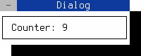
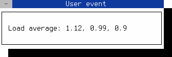

Event Processing
================

Table of Contents
-----------------

<!-- toc -->
- [Event handling](#how-events-are-processed)
- [Event handler reimplementation](#event-handler-reimplementation)
- [Event types](#available-event-types)
- [Timer event](#using-a-timer-event)
- [User event](#using-a-user-event)
<!-- endtoc -->


How events are processed
------------------------

The main event loop is initiated by calling `FApplication::exec()`.
While the event loop is running, the system continuously monitors 
for events and sends them to the currently focused object. 
Terminal events, such as keystrokes, mouse actions, or resizing the terminal, 
are translated into `FEvent` objects, and are sent to the active `FObject`. 
You can also use the `FApplication::sendEvent()` or `FApplication::queueEvent()`
methods to send a specific event to an object.

Objects derived from the class `FObject` process incoming events by 
overriding the virtual method `event()`. The `FObject` itself can only 
call its own events, `onTimer()` and `onUserEvent()`, and discards all others. 
The `FObject`-derived class `FWidget` also reimplements the `event()` method 
to handle further events. `FWidget` calls the `FWidget::onKeyPress` method 
when a key is pressed, or the `FWidget::onMouseDown` method when a mouse
button is clicked.


Reimplementing Event Handlers
-----------------------------

An event in FINAL CUT is an object that inherits from the base class 
`FEvent`. There are several types of events, represented by an enum value. 
For example, the method `FEvent::type()` returns the type 
`Event::MouseDown` when you press down a mouse button. 

Some events contain data that doesn't fit in a standard FEvent object. 
Some types of events have data that cannot be stored in an `FEvent` object. 
For example, a mouse click event from the mouse requires storing which 
button was triggered and the position of the mouse pointer at that time. Classes 
derived from `FEvent`, such as `FMouseEvent`, store this data.

Widgets get their events from the `event()` method inherited from `FObject`.
In `FWidget`, the implementation of `event()` forwards the most common event
types to specific event handlers, such as `FMouseEvent()`, `FKeyEvent()`,
or `FResizeEvent()`. There are many other available events. You can create 
your own types of events and send them to other objects and widgets.


Available event types
---------------------

```cpp
enum class Event : uInt8
{
  None,              // Invalid event
  KeyPress,          // Key pressed
  KeyUp,             // Key released
  KeyDown,           // Key pressed
  MouseDown,         // Mouse button pressed
  MouseUp,           // Mouse button released
  MouseDoubleClick,  // Mouse button double click
  MouseWheel,        // Mouse wheel rolled
  MouseMove,         // Mouse move
  FocusIn,           // Focus in
  FocusOut,          // Focus out
  ChildFocusIn,      // Child focus in
  ChildFocusOut,     // Child focus out
  FailAtChildFocus,  // No further focusable child widgets
  TerminalFocusIn,   // Terminal focus in
  TerminalFocusOut,  // Terminal focus out
  WindowActive,      // Activate window
  WindowInactive,    // Deactivate window
  WindowRaised,      // Raise window
  WindowLowered,     // Lower window
  Accelerator,       // Keyboard accelerator
  Resize,            // Terminal resize
  Show,              // Widget is shown
  Hide,              // Widget is hidden
  Close,             // Widget close
  Timer,             // Timer event occurred
  User               // User defined event
};
```


Using a timer event
-------------------

The following example starts a periodic timer that triggers an `FTimerEvent()`
every 100 milliseconds. Then, the virtual method `onTimer()` is repeatedly
called within the same dialog.

**File:** *timer.cpp*
```cpp
#include <final/final.h>

using namespace finalcut;

class DialogWidget : public FDialog
{
  public:
    explicit DialogWidget (FWidget* parent = nullptr)
      : FDialog{parent}
    {
      label.setAlignment (Align::Right);
      id = addTimer(100);
    }

  private:
    void initLayout()
    {
      setText ("Dialog");
      setGeometry (FPoint{25, 5}, FSize{23, 4});
      label.setGeometry (FPoint{1, 1}, FSize{10, 1});
      value.setGeometry (FPoint{11, 1}, FSize{10, 1});
      FDialog::initLayout();
    }

    void onTimer (FTimerEvent* ev) override
    {
      if ( id == ev->getTimerId() && n < 9999999999 )
      {
        value.setNumber(n);
        value.redraw();
        n++;
      }
    }

    FLabel label{"Counter: ", this};
    FLabel value{"0", this};
    long n{0};
    int id{0};
};

auto main (int argc, char* argv[]) -> int
{
  FApplication app(argc, argv);
  DialogWidget dialog(&app);
  FWidget::setMainWidget(&dialog);
  dialog.show();
  return app.exec();
}
```
<figure class="image">
  
  <figcaption>Figure 1:  FObject::onTimer event handler</figcaption>
</figure>
<br /><br />

> [!NOTE]
> To close the dialog, use the mouse or press 
> <kbd>Shift</kbd>+<kbd>F10</kbd> or <kbd>Ctrl</kbd>+<kbd>^</kbd>


Save the code as *timer.cpp* and compile it using the following 
command:
```bash
c++ timer.cpp -o timer -O2 -lfinal -std=c++14
```


Using a user event
------------------

Use the `FUserEvent()` method to create and send a custom event to 
a specific object. If you want to create more than one user event, you can 
specify an identification number (ID) to differentiate between them. In the 
example below, the ID is 0. This number can be retrieved using the 
`getUserId()` method.

User events should be generated in the main event loop. For this purpose, 
the class `FApplication` provides the virtual method 
`processExternalUserEvent()`. This method can be overridden in a derived 
class to implement custom logic.

The following example reads the average system load and creates a user event 
when a value changes. This event sends the current values to an `FLabel` 
widget and displays them in the terminal.


**File:** *user-event.cpp*
```cpp
#include <stdlib.h>
#include <final/final.h>
#define _BSD_SOURCE 1
#define _DEFAULT_SOURCE 1

using LoadAvg = double[3];
using namespace finalcut;

class ExtendedApplication : public FApplication
{
  public:
    ExtendedApplication (const int& argc, char* argv[])
      : FApplication(argc, argv)
    { }

  private:
    void processExternalUserEvent() override
    {
      if ( getMainWidget() )
      {
        if ( getloadavg(load_avg, 3) < 0 )
          FApplication::getLog()->error("Can't get load average values");

        if ( last_avg[0] != load_avg[0]
          || last_avg[1] != load_avg[1]
          || last_avg[2] != load_avg[2] )
        {
          FUserEvent user_event(Event::User, 0);
          user_event.setData (load_avg);
          FApplication::sendEvent (getMainWidget(), &user_event);
        }

        for (std::size_t i = 0; i < 3; i++)
          last_avg[i] = load_avg[i];
      }
    }

    // Data member
    LoadAvg load_avg{}, last_avg{};
};


class DialogWidget final : public FDialog
{
  public:
    explicit DialogWidget (FWidget* parent = nullptr)
      : FDialog{"User event", parent}
    { }

  private:
    void initLayout()
    {
      FDialog::setGeometry (FPoint{25, 5}, FSize{40, 6});
      loadavg_label.setGeometry (FPoint{2, 2}, FSize{36, 1});
      FDialog::initLayout();
    }

    void onUserEvent (FUserEvent* ev) override
    {
      const auto& lavg = ev->getData<LoadAvg>();
      std::setlocale(LC_NUMERIC, "C");
      loadavg_label.clear();
      loadavg_label << "Load average: " << lavg[0] << ", "
                                        << lavg[1] << ", "
                                        << lavg[2] << " ";
      loadavg_label.redraw();
    }

    FLabel loadavg_label{this};
};

auto main (int argc, char* argv[]) -> int
{
  ExtendedApplication app(argc, argv);
  DialogWidget dialog(&app);
  FWidget::setMainWidget(&dialog);
  dialog.show();
  return app.exec();
}
```
<figure class="image">
  
  <figcaption>Figure 2:  User event generation</figcaption>
</figure>
<br /><br />

> [!NOTE]
> To close the dialog, use the mouse or press 
> <kbd>Shift</kbd>+<kbd>F10</kbd> or <kbd>Ctrl</kbd>+<kbd>^</kbd>


After entering the source code in *user-event.cpp* you can compile
the above program with:
```bash
c++ user-event.cpp -o user-event -O2 -lfinal -std=c++14
```
