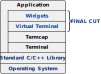
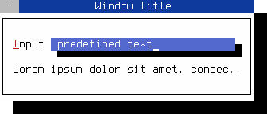
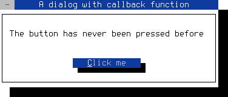
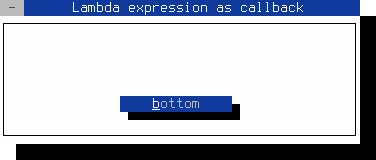
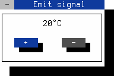
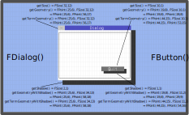
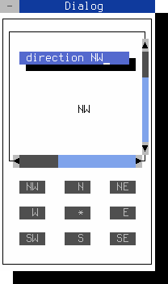

First steps with the FINAL CUT widget toolkit 
=============================================

Table of Contents
-----------------

<!-- TOC -->
- [Basic functions](#basic-functions)
- [How to use the library](#how-to-use-the-library)
- [Memory Management](#memory-management)
- [Event Processing](#event-processing)
  - [Event handler reimplementation](#event-handler-reimplementation)
  - [Event types](#available-event-types)
  - [Timer event](#using-a-timer-event)
  - [User event](#using-a-user-event)
- [Signals and Callbacks](#signals-and-callbacks)
  - [Default signals](#the-final-cut-widgets-emit-the-following-default-signals)
  - [Callback function](#example-of-a-callback-function)
  - [Callback lambda expression](#example-of-an-lambda-expression-callback)
  - [Callback method](#example-of-a-callback-function)
  - [Custom signals](#send-custom-signals)
- [Widget layout](#widget-layout)
  - [Coordinates](#coordinates)
  - [Lengths](#lengths)
  - [Areas](#areas)
  - [Dynamic layout](#dynamic-layout)
- [Scroll view](#scroll-view)
<!-- /TOC -->


Basic functions
---------------

FINAL CUT is a library for creating text-based terminal applications.
It runs on several Unix-like platforms. The release of FINAL CUT is
licensed under the terms of the GNU Lesser General Public License v3.0
([GNU LGPL v3](https://www.gnu.org/licenses/lgpl-3.0-standalone.html)),
which allows flexible licensing of applications. FINAL CUT was written
in the programming language [C++](https://en.wikipedia.org/wiki/C%2B%2B).
The object-oriented design allows the creation of fast and lean programs.

FINAL CUT is a [widget toolkit](http://en.wikipedia.org/wiki/Widget_toolkit).
A user interface usually consists of several
[widgets](https://en.wikipedia.org/wiki/Software_widget). FINAL CUT
draws widgets on virtual windows and then mapped them on a virtual
terminal. It uses the terminal capabilities from the
[Termcap library](https://en.wikipedia.org/wiki/Termcap) to display
the character matrix of the virtual terminal on the screen or a terminal
emulator. It uses various optimization methods to improve the drawing speed.

<figure class="image">
  
  <figcaption>Figure 1.  Structure of a FINAL CUT application</figcaption>
</figure>


How to use the library
----------------------

At the beginning of this introduction to the FINAL CUT
we will start with a small example.

The following example creates an empty 30&times;10 character dialog.

**File:** *dialog.cpp*
```cpp
#include <final/final.h>

int main (int argc, char* argv[])
{
  finalcut::FApplication app(argc, argv);
  finalcut::FDialog dialog(&app);
  dialog.setText ("A dialog");
  const finalcut::FPoint position{25, 5};
  const finalcut::FSize size{30, 10};
  dialog.setGeometry (position, size);
  finalcut::FWidget::setMainWidget(&dialog);
  dialog.show();
  return app.exec();
}
```
<figure class="image">
  
  <figcaption>Figure 2.  A blank dialog</figcaption>
</figure>
<br /><br />

*(Note: You can close the dialog with the mouse, 
<kbd>Shift</kbd>+<kbd>F10</kbd> or <kbd>Ctrl</kbd>+<kbd>^</kbd>)*


After entering the source code in *dialog.cpp* you can compile
the above program with gcc:
```cpp
g++ -O2 -lfinal dialog.cpp -o dialog
```


How it works
------------


```cpp
#include <final/final.h>
```
All final cut programs must include the *final.h* header.

```cpp
finalcut::FApplication app(argc, argv);
```
This line creates the `finalcut::FApplication` object `app` with
the command line arguments `argc` and `argv`. This object manages
the application main event loop. It receives keyboard and mouse events
and sends them to the target widgets. You must create an application
object before you can create a widgets object.

The next line
```cpp
finalcut::FDialog dialog(&app);
```
creates the `finalcut::FDialog` object `dialog` with the object `app`
as parent object. The `finalcut::FDialog` class is the base class for
creating dialog windows.

```cpp
dialog.setText ("A dialog");
```
The title bar of the dialog box gets the text "A dialog".

```cpp
finalcut::FPoint position{25, 5};
finalcut::FSize size{30, 10};
dialog.setGeometry (position, size);
```
The dialog window gets a width of 30 and a height of 10 characters.
The position of the window in the terminal is at x=25 and
y=5 (note: x=1 and y=1 represents the upper left corner).

```cpp
finalcut::FWidget::setMainWidget(&dialog);
```
The `dialog` object was now selected as the main widget for the application.
When you close the main widget, the entire application quits.


```cpp
dialog.show();
```
A window or widget is not visible directly after its creation.
Only the call of `show()` makes it (and its child objects,
if available) visible.

```cpp
return app.exec();
```
The last line calls `exec()` to start the application and return
the result to the operating system. The started application enters
the main event loop. This loop does not end until the window is
not closed.


Memory Management
-----------------

To create a hierarchy of FObjects (or derived classes/widgets), 
a new FObject must initialize with its parent object.

```cpp
FObject* parent = new FObject();
FObject* child  = new FObject(parent);
```

To deallocate the used memory of a parent FObject, the allocated memory 
of its child objects will also automatically deallocate.

An object can also be assigned to another object later via `addChild()`.

```cpp
FObject* parent = new FObject();
FObject* child = new FObject();
parent->addChild(child);
```

The child object assignment can also remove at any time with 
`delChild()`.

```cpp
FObject* parent = new FObject();
FObject* child  = new FObject(parent);
parent->delChild(child);
```

If an FObject with a parent will remove from the hierarchy, 
the destructor automatically deletes the object assignment from 
its parent object. If a class object doesn't derive from FObject, 
you must implement storage deallocation yourself.

**File:** *memory.cpp*
```cpp
#include <final/final.h>

using namespace finalcut;

int main (int argc, char* argv[])
{
  FApplication app(argc, argv);

  // The object dialog is managed by app
  FDialog* dialog = new FDialog(&app);
  dialog->setText ("Window Title");
  dialog->setGeometry (FPoint{25, 5}, FSize{40, 8});

  // The object input is managed by dialog
  FLineEdit* input = new FLineEdit("predefined text", dialog);
  input->setGeometry(FPoint{8, 2}, FSize{29, 1});
  input->setLabelText (L"&Input");

  // The object label is managed by dialog
  FLabel* label = new FLabel ( "Lorem ipsum dolor sit amet, consectetur "
                               "adipiscing elit, sed do eiusmod tempor "
                               "incididunt ut labore et dolore magna aliqua."
                             , dialog );
  label->setGeometry (FPoint{2, 4}, FSize{36, 1});
  FWidget::setMainWidget(dialog);
  dialog->show();
  return app.exec();
}
```
<figure class="image">
  
  <figcaption>Figure 3.  FObject manages its child objects</figcaption>
</figure>
<br /><br />

*(Note: You can close the window with the mouse, 
<kbd>Shift</kbd>+<kbd>F10</kbd> or <kbd>Ctrl</kbd>+<kbd>^</kbd>)*


After entering the source code in *memory.cpp* you can compile
the above program with gcc:
```cpp
g++ -O2 -lfinal memory.cpp -o memory
```


Event Processing
----------------

Calling `FApplication::exec()` starts the FINAL CUT main event loop. 
While the event loop is running, the system checks all the time whether 
an event has occurred and sends it to the application's currently focused 
object. The events of the terminal, such as keystrokes, mouse actions, or 
terminal size changing, are translated into `FEvent` objects, and sent them to 
the active `FObject`. It is also possible to use `FApplication::sendEvent()` 
or `FApplication::queueEvent()` to send a specific event to an object.

`FObject`-derived objects process incoming events by reimplementing the 
virtual method `event()`. The `FObject` itself can only call its own events 
`onTimer()` and `onUserEvent()` and ignores all other events. The 
`FObject`-derived class `FWidget` also reimplements the `event()` method 
to handle further events. `FWidget` calls the `FWidget::onKeyPress` method
when you press a key, or the `FWidget::onMouseDown` method when you click 
a mouse button.


### Event handler reimplementation ###

An event in FINAL CUT is an object that inherits from the base class 
`FEvent`. There are several event types, represented by an enum value. 
For example, the method `FEvent::type()` returns the type 
`fc::MouseDown_Event` when you press down a mouse button. 

Some event types have data that cannot store in an `FEvent` object. 
For example, a click event of the mouse must store which button is 
triggered and where the mouse pointer was at that time. In classes derived 
from `FEvent`, such as `FMouseEvent()`, we store this data.

Widgets get their events from the `event()` method inherited from FObject. 
The implementation of `event()` in `FWidget` forwards the most common event 
types to specific event handlers such as `FMouseEvent()`, `FKeyEvent()` or 
`FResizeEvent()`. There are many other event types. You can create own event 
types and send them to other objects and widgets.


### Available event types ###
```cpp
enum events
{
  None_Event,               // invalid event
  KeyPress_Event,           // key pressed
  KeyUp_Event,              // key released
  KeyDown_Event,            // key pressed
  MouseDown_Event,          // mouse button pressed
  MouseUp_Event,            // mouse button released
  MouseDoubleClick_Event,   // mouse button double click
  MouseWheel_Event,         // mouse wheel rolled
  MouseMove_Event,          // mouse move
  FocusIn_Event,            // focus in
  FocusOut_Event,           // focus out
  ChildFocusIn_Event,       // child focus in
  ChildFocusOut_Event,      // child focus out
  WindowActive_Event,       // activate window
  WindowInactive_Event,     // deactivate window
  WindowRaised_Event,       // raise window
  WindowLowered_Event,      // lower window
  Accelerator_Event,        // keyboard accelerator
  Resize_Event,             // terminal resize
  Show_Event,               // widget is shown
  Hide_Event,               // widget is hidden
  Close_Event,              // widget close
  Timer_Event,              // timer event occur
  User_Event                // user defined event
};
```


### Using a timer event ###

The following example starts a periodic timer that triggers an `FTimerEvent()` 
every 100 ms. The virtual method `onTimer()` is then called each time in the 
same dialog object.

**File:** *timer.cpp*
```cpp
#include <final/final.h>

using namespace finalcut;

class dialogWidget : public FDialog
{
  public:
    explicit dialogWidget (FWidget* parent = nullptr)
      : FDialog{parent}
    {
      setText ("Dialog");
      setGeometry (FPoint{25, 5}, FSize{23, 4});
      label.setGeometry (FPoint{1, 1}, FSize{10, 1});
      label.setAlignment (fc::alignRight);
      value.setGeometry (FPoint{11, 1}, FSize{10, 1});
      id = addTimer(100);
    }

  private:
    void onTimer (FTimerEvent* ev) override
    {
      if ( id == ev->getTimerId() && n < 9999999999 )
      {
        value.setNumber(n);
        value.redraw();
        n++;
      }
    }

    FLabel label{"Counter: ", this};
    FLabel value{"0", this};
    long n{0};
    int id{0};
};

int main (int argc, char* argv[])
{
  FApplication app(argc, argv);
  dialogWidget dialog(&app);
  FWidget::setMainWidget(&dialog);
  dialog.show();
  return app.exec();
}
```
<figure class="image">
  
  <figcaption>Figure 4.  FObject::onTimer event handler</figcaption>
</figure>
<br /><br />

*(Note: You can close the window with the mouse, 
<kbd>Shift</kbd>+<kbd>F10</kbd> or <kbd>Ctrl</kbd>+<kbd>^</kbd>)*


After entering the source code in *timer.cpp* you can compile
the above program with gcc:
```cpp
g++ -O2 -lfinal -std=c++11 timer.cpp -o timer
```


### Using a user event ###

You can use the `FUserEvent()` to create a individual event and send it to a 
specific object. If you want to create more than one user event, you can 
specify an identification number (0 in the example below) to identify the 
different events. This number can get later with `getUserId()`.

User events should be generated in the main event loop. For this purpose, 
the class `FApplication` provides the virtual method 
`processExternalUserEvent()`. This method can be overwritten in a derived 
class and filled with user code.

The following example reads the average system load and creates a user event 
when a value changes. This event sends the current values to an `FLabel` 
widget and displays them in the terminal.


**File:** *user-event.cpp*
```cpp
#include <stdlib.h>
#include <final/final.h>
#define _BSD_SOURCE 1
#define _DEFAULT_SOURCE 1

using LoadAvg = double[3];
using namespace finalcut;

class extendedApplication : public FApplication
{
  public:
    extendedApplication (const int& argc, char* argv[])
      : FApplication(argc, argv)
    { }

  private:
    void processExternalUserEvent() override
    {
      if ( getMainWidget() )
      {
        if ( getloadavg(load_avg, 3) < 0 )
          FApplication::getLog()->error("Can't get load average values");

        if ( last_avg[0] != load_avg[0]
          || last_avg[1] != load_avg[1]
          || last_avg[2] != load_avg[2] )
        {
          FUserEvent user_event(fc::User_Event, 0);
          user_event.setData (load_avg);
          FApplication::sendEvent (getMainWidget(), &user_event);
        }

        for (std::size_t i = 0; i < 3; i++)
          last_avg[i] = load_avg[i];
      }
    }

    // Data member
    LoadAvg load_avg{}, last_avg{};
};


class dialogWidget final : public FDialog
{
  public:
    explicit dialogWidget (FWidget* parent = nullptr)
      : FDialog{"User event", parent}
    {
      FDialog::setGeometry (FPoint{25, 5}, FSize{40, 6});
      loadavg_label.setGeometry (FPoint{2, 2}, FSize{36, 1});
    }

  private:
    void onUserEvent (FUserEvent* ev) override
    {
      const auto& lavg = ev->getData<LoadAvg>();
      std::setlocale(LC_NUMERIC, "C");
      loadavg_label.clear();
      loadavg_label << "Load average: " << lavg[0] << ", "
                                        << lavg[1] << ", "
                                        << lavg[2] << " ";
      loadavg_label.redraw();
    }

    FLabel loadavg_label{this};
};


int main (int argc, char* argv[])
{
  extendedApplication app(argc, argv);
  dialogWidget dialog(&app);
  FWidget::setMainWidget(&dialog);
  dialog.show();
  return app.exec();
}
```
<figure class="image">
  
  <figcaption>Figure 5.  User event generation</figcaption>
</figure>
<br /><br />

*(Note: You can close the window with the mouse, 
<kbd>Shift</kbd>+<kbd>F10</kbd> or <kbd>Ctrl</kbd>+<kbd>^</kbd>)*


After entering the source code in *user-event.cpp* you can compile
the above program with gcc:
```cpp
g++ -O2 -lfinal -std=c++11 user-event.cpp -o user-event
```


Signals and Callbacks
---------------------

The callback mechanism is essential for developing applications with 
FINAL CUT. Callback routines allow the programmer to connect different 
objects (which do not need to know each other). Connected objects notify 
each other when an action occurs in a widget. To uniquely identify a widget 
action, it uses signal strings. For example, if an `FButton` object gets 
clicked by a keyboard or mouse, it sends the string "clicked". A signal 
handler explicitly provided by Widget, in the form of a callback function 
or a callback method, can react to such a signal.

A callback function has no return value and can have various arguments:

```cpp
void cb_function (FWidget* w, int* i, double* d, ...)
{...}
```

The structure of a callback method is the same:

```cpp
void classname::cb_methode (FWidget* w, int* i, double* d, ...)
{...}
```

We use the `addCallback()` method of the `FWidget` class to connect 
to other widget objects.

1. For calling functions or static methods via a pointer:

```cpp
template< typename Function
        , typename FunctionPointer<Function>::type = nullptr
        , typename... Args >
void FWidget::addCallback ( const FString& cb_signal
                          , Function&&     cb_function
                          , Args&&...      args)
{...}
```

2. For calling functions or static methods via a reference:

```cpp
template< typename Function
        , typename FunctionReference<Function>::type = nullptr
        , typename... Args >
void FWidget::addCallback ( const FString& cb_signal
                          , Function&      cb_function
                          , Args&&...      args)
{...}
```

3. For calling a member method of a specific instance:

```cpp
template< typename Object
        , typename Function
        , typename ObjectPointer<Object>::type = nullptr
        , typename MemberFunctionPointer<Function>::type = nullptr
        , typename... Args >
void FWidget::addCallback ( const FString& cb_signal
                          , Object&&       cb_instance
                          , Function&&     cb_member
                          , Args&&...      args)
{...}
```

4. For calling a std::bind call wrapper or a lambda expression:
```cpp
template< typename Function
        , typename ClassObject<Function>::type = nullptr
        , typename... Args >
void FWidget::addCallback ( const FString& cb_signal
                          , Function&&     cb_function
                          , Args&&...      args)
{...}
```

5. For calling a std::bind call wrapper to a specific instance:

```cpp
template< typename Object
        , typename Function
        , typename ObjectPointer<Object>::type = nullptr
        , typename ClassObject<Function>::type = nullptr
        , typename... Args >
void FWidget::addCallback ( const FString& cb_signal
                          , Object&&       cb_instance
                          , Function&&     cb_function
                          , Args&&...      args)
{...}
```

6. For calling a lambda function that has been stored in a variable
with the keyword auto:

```cpp
template< typename Function
        , typename ClassObject<Function>::type = nullptr
        , typename... Args >
void FWidget::addCallback ( const FString& cb_signal
                          , Function&      cb_function
                          , Args&&...      args)
{...}
```

With `delCallback(...)` you can remove a connection to a signal handler
or a widget instance. Alternatively, you can use `delCallbacks()` to
remove all existing callbacks from an object.

1. To delete functions or static methods callbacks via a pointer:

```cpp
template< typename FunctionPtr
        , typename FunctionPointer<FunctionPtr>::type = nullptr >
void FWidget::delCallback (FunctionPtr&& cb_func_ptr)
{...}
```

2. To delete functions or static methods callbacks via a reference:

```cpp
template< typename Function
        , typename FunctionReference<Function>::type = nullptr >
void FWidget::delCallback (Function& cb_function)
{...}
```

3. To delete all callbacks from a specific instance:

```cpp
template< typename Object
        , typename ObjectPointer<Object>::type = nullptr >
void FWidget::delCallback (Object&& cb_instance)
{...}
```

4. To delete all callbacks of a signal:

```cpp
void delCallback (const FString& cb_signal)
{...}
```

5. To delete all callbacks of a signal and specific instance:

```cpp
template< typename Object
        , typename ObjectPointer<Object>::type = nullptr >
void delCallback (const FString& cb_signal, Object&& cb_instance)
{...}
```

6. To delete all callbacks from a widget:

```cpp
void delCallback()
{...}
```


### The FINAL CUT widgets emit the following default signals ###

<dl>
  <dt>FButton</dt>
  <dd>"clicked"</dd>

  <dt>FCheckMenuItem</dt>
  <dd>"clicked"<br />"toggled"</dd>

  <dt>FLineEdit</dt>
  <dd>"activate"<br />"changed"</dd>

  <dt>FListBox</dt>
  <dd>"clicked"<br />"row-changed"<br />"row-selected"</dd>

  <dt>FListView</dt>
  <dd>"clicked"<br />"row-changed"</dd>

  <dt>FMenu</dt>
  <dd>"activate"</dd>

  <dt>FMenuItem</dt>
  <dd>"activate"<br />"clicked"<br />"deactivate"</dd>

  <dt>FRadioMenuItem</dt>
  <dd>"clicked"<br />"toggled"</dd>

  <dt>FScrollbar</dt>
  <dd>"change-value"</dd>

  <dt>FSpinBox</dt>
  <dd>"changed"</dd>

  <dt>FStatusBar</dt>
  <dd>"activate"</dd>

  <dt>FTextView</dt>
  <dd>"changed"</dd>

  <dt>FToggleButton</dt>
  <dd>"clicked"<br />"toggled"</dd>

  <dt>FWidget</dt>
  <dd>"destroy"<br />"enable"<br />"disable"<br />"focus-in"<br />"focus-out"<br />"mouse-press"<br />"mouse-release"<br />"mouse-move"<br />"mouse-wheel-down"<br />"mouse-wheel-up"</dd>
</dl>

&nbsp;

### Example of a callback function: ###

**File:** *callback-function.cpp*

```cpp
#include <final/final.h>

using namespace finalcut;

void cb_changeText (const FButton& button, FLabel& label)
{
  label.clear();
  label << "The " << button.getClassName() << " was pressed";
  label.redraw();
}

int main (int argc, char* argv[])
{
  FApplication app(argc, argv);
  FDialog dialog(&app);
  dialog.setText ("A dialog with callback function");
  dialog.setGeometry (FRect{25, 5, 45, 9});
  FLabel label (&dialog);
  label = "The button has never been pressed before";
  label.setGeometry (FPoint{2, 2}, FSize{41, 1});
  FButton button (&dialog);
  // Character follows '&' will be used as the accelerator key
  button = "&Click me";
  button.setGeometry (FPoint{15, 5}, FSize{14, 1});

  // Connect the button signal "clicked" with the callback function
  button.addCallback
  (
    "clicked",          // Callback signal
    &cb_changeText,     // Function pointer
    std::cref(button),  // First function argument
    std::ref(label)     // Second function argument
  );

  FWidget::setMainWidget(&dialog);
  dialog.show();
  return app.exec();
}
```
<figure class="image">
  
  <figcaption>Figure 6.  Button with a callback function</figcaption>
</figure>
<br /><br />

*(Note: You can close the dialog with the mouse, 
<kbd>Shift</kbd>+<kbd>F10</kbd> or <kbd>Ctrl</kbd>+<kbd>^</kbd>)*


After entering the source code in *callback-function.cpp* you can compile
the above program with gcc:
```cpp
g++ -O2 -lfinal callback-function.cpp -o callback-function
```
&nbsp;

### Example of an lambda expression callback: ###

**File:** *callback-lambda.cpp*

```cpp
#include <final/final.h>

using namespace finalcut;

int main (int argc, char* argv[])
{
  FApplication app(argc, argv);
  FDialog dialog(&app);
  dialog.setText ("Lambda expression as callback");
  dialog.setGeometry (FRect{25, 5, 45, 9});
  FButton button ("&bottom", &dialog);
  button.setGeometry (FPoint{15, 5}, FSize{14, 1});

  // Connect the button signal "clicked" with the lambda expression
  button.addCallback
  (
    "clicked",                          // Callback signal
    [] (FButton& button, FDialog& dgl)  // Lambda function
    {
      if ( button.getY() != 2 )
      {
        button.setPos (FPoint{15, 2});
        button.setText("&top");
      }
      else
      {
        button.setPos (FPoint{15, 5});
        button.setText("&bottom");
      }

      dgl.redraw();
    },
    std::ref(button),                   // First function argument
    std::ref(dialog)                    // Second function argument
  );

  FWidget::setMainWidget(&dialog);
  dialog.show();
  return app.exec();
}
```
<figure class="image">
  
  <figcaption>Figure 7.  Button with lambda expression callback.</figcaption>
</figure>
<br /><br />

*(Note: You can close the dialog with the mouse, 
<kbd>Shift</kbd>+<kbd>F10</kbd> or <kbd>Ctrl</kbd>+<kbd>^</kbd>)*


After entering the source code in *callback-lambda.cpp* you can compile
the above program with gcc:
```cpp
g++ -O2 -lfinal -std=c++11 callback-lambda.cpp -o callback-lambda
```
&nbsp;

### Example of a callback method: ###

**File:** *callback-method.cpp*

```cpp
#include <final/final.h>

using namespace finalcut;

class dialogWidget : public FDialog
{
  public:
    explicit dialogWidget (FWidget* parent = nullptr)
      : FDialog{parent}
    {
      setText ("Callback method");
      setGeometry (FPoint{25, 5}, FSize{25, 7});
      button.setGeometry (FPoint{7, 3}, FSize{10, 1});

      // Connect the button signal "clicked" with the callback method
      button.addCallback
      (
        "clicked",                            // Callback signal
        finalcut::getFApplication(),          // Class instance
        &finalcut::FApplication::cb_exitApp,  // Method pointer
        this                                  // Function argument
      );
    }

  private:
    FButton button{"&Quit", this};
};

int main (int argc, char* argv[])
{
  FApplication app(argc, argv);
  dialogWidget dialog(&app);
  FWidget::setMainWidget(&dialog);
  dialog.show();
  return app.exec();
}
```
<figure class="image">
  
  <figcaption>Figure 8.  Button with a callback method</figcaption>
</figure>
<br /><br />

*(Note: You can close the window with the mouse, 
<kbd>Shift</kbd>+<kbd>F10</kbd> or <kbd>Ctrl</kbd>+<kbd>^</kbd>)*


After entering the source code in *callback-method.cpp* you can compile
the above program with gcc:
```cpp
g++ -O2 -lfinal -std=c++11 callback-method.cpp -o callback-method
```
&nbsp;


### Send custom signals ###

You can use the `emitCallback()` method to generate a user-defined signal. 
You can connect this signal later with the method `addCallback()` to a 
self-defined routine.

**File:** *emit-signal.cpp*
```cpp
#include <final/final.h>

using namespace finalcut;

class dialogWidget : public FDialog
{
  public:
    explicit dialogWidget (FWidget* parent = nullptr)
      : FDialog{parent}
    {
      setGeometry (FPoint{25, 5}, FSize{22, 7});
      setText ("Emit signal");
      const FSize size{5, 1};
      label.setGeometry (FPoint{8, 1}, size);
      label.setAlignment (fc::alignRight);
      label.setForegroundColor (fc::Black);
      plus.setGeometry (FPoint{3, 3}, size);
      minus.setGeometry (FPoint{3, 3} + FPoint{10, 0}, size);
      plus.setNoUnderline();
      minus.setNoUnderline();

      // Connect the button signal "clicked" with the callback method
      plus.addCallback ("clicked", this, &dialogWidget::cb_plus);
      minus.addCallback ("clicked", this, &dialogWidget::cb_minus);

      // Connect own signals
      addCallback ("hot", this, &dialogWidget::cb_set_red);
      addCallback ("regular", this, &dialogWidget::cb_set_black);
      addCallback ("cold", this, &dialogWidget::cb_set_blue);
    }

  private:
    void cb_plus()
    {
      if ( t < 100 )
        t++;

      if ( t == 30 )
        emitCallback("hot");
      else if ( t == 1 )
        emitCallback("regular");

      setTemperature();
    }

    void cb_minus()
    {
      if ( t > -99 )
        t--;

      if ( t == 0 )
        emitCallback("cold");
      else if ( t == 29 )
        emitCallback("regular");

      setTemperature();
    }

    void cb_set_blue()
    {
      label.setForegroundColor (fc::Blue);
    }

    void cb_set_black()
    {
      label.setForegroundColor (fc::Black);
    }

    void cb_set_red()
    {
      label.setForegroundColor (fc::Red);
    }

    void setTemperature()
    {
      label.clear();
      label << t << "°C";
      label.redraw();
    }

    int t = 20;
    FLabel label{FString() << t << "°C", this};
    FButton plus {"&+", this};
    FButton minus {"&-", this};
};

int main (int argc, char* argv[])
{
  FApplication app(argc, argv);
  dialogWidget dialog(&app);
  FWidget::setMainWidget(&dialog);
  dialog.show();
  return app.exec();
}
```
<figure class="image">
  
  <figcaption>Figure 9.  Callbacks with custom signals</figcaption>
</figure>
<br /><br />

*(Note: You can close the window with the mouse, 
<kbd>Shift</kbd>+<kbd>F10</kbd> or <kbd>Ctrl</kbd>+<kbd>^</kbd>)*


After entering the source code in *emit-signal.cpp* you can compile
the above program with gcc:
```cpp
g++ -O2 -lfinal -std=c++11 emit-signal.cpp -o emit-signal
```


Widget layout
-------------

### Coordinates ###

The positioning of a widget in the terminal works via a coordinate 
system. It consists of _x_ characters in the horizontal and _y_ 
characters in the vertical. The upper left corner has the coordinates 
(1, 1). With the commands `getDesktopWidth()` and `getDesktopHeight()`, 
the width and height of the terminal get retrieved. These two values 
result in the position of the lower right terminal corner. The position 
of a widget is retrievable with `getX()`, `getY()`, and `getPos()` or 
is definable with `setX()`, `setY()`, and `setPos()`. The data type for 
each coordinate is an `int`. All positions represent an `FPoint` 
object. The positioning of the widget is always relative to its parent 
widget. The top parent widget in a chain of children contains the 
terminal desktop. There the absolute terminal positions are still 
identical to the relative positions (`getPos()` = `getTermPos()`). In 
the case of a child widget, the positioning is corresponding to the 
upper left corner of the parent widget plus a possible padding space 
(can be determined with `getLeftPadding()` and `getTopPadding()`). 
If you want to ignore padding spaces, you must force this with the 
`ignorePadding()` method.

<figure class="image">
  
  <figcaption>Figure 10.  Widget coordinates</figcaption>
</figure>
<br /><br />

```cpp
int              getX() const;
int              getY() const;
const FPoint     getPos() const;
int              getTermX() const;
int              getTermY() const;
const FPoint     getTermPos() const;
virtual void     setX (int x, bool adjust = true);
virtual void     setY (int y, bool adjust = true);
virtual void     setPos (const FPoint& p, bool adjust = true);
```

If you set the value of `adjust` to `false` when calling `setX()`, 
`setY()`, or `setPos()`, this will prevent the explicit call of 
`adjustSize()` afterward.  This is important to avoid `adjustSize()` 
loops or to block the `adjustSize()` call from being repeated 
unnecessarily often.


### Lengths ###

The dimensions of a widget can be retrieved and defined separately in 
width and height. The methods `getWidth()` and `getHeight()` 
respectively `setWidth()` and `setHeight()` are used for this. Because 
a length cannot be negative, all lengths are of type `std::size_t`. 
The maximum size of a child widget automatically results from the size 
of the parent widget, which is retrievable with `getClientWidth()` and 
`getClientHeight()`. Some widgets have a border, a title bar, or both, 
which can reduce the maximum size of the child widget.

&#160;&#160;&#160;&#160;&#160;&#160;&#160;&#160;widget width ≥ client widget width<br />
&#160;&#160;&#160;&#160;&#160;&#160;&#160;&#160;widget height ≥ client widget height

Corresponding padding space ensures the correct distance here. The 
padding space can be retrieved separately for all four sides with 
the widget methods `getTopPadding()`, `getLeftPadding()`, 
`getBottomPadding()`, and `getRightPadding()`. You can set the 
required padding space for the widget using the `setTopPadding()`, 
`setLeftPadding()`, `setBottomPadding()` and `setRightPadding()` 
methods.

&#160;&#160;&#160;&#160;&#160;&#160;&#160;&#160;widget width = left padding + client width + right padding<br />
&#160;&#160;&#160;&#160;&#160;&#160;&#160;&#160;widget height = top padding + client height + bottom padding

<figure class="image">
  
  <figcaption>Figure 11.  Width and height of a widget</figcaption>
</figure>
<br /><br />


```cpp
std::size_t    getWidth() const;
std::size_t    getHeight() const;
std::size_t    getClientWidth() const;
std::size_t    getClientHeight() const;
int            getTopPadding() const;
int            getLeftPadding() const;
int            getBottomPadding() const;
int            getRightPadding() const;
virtual void   setWidth (std::size_t width, bool adjust = true);
virtual void   setHeight (std::size_t height, bool adjust = true);
void           setTopPadding (int top, bool adjust = true);
void           setLeftPadding (int left, bool adjust = true);
void           setBottomPadding (int bottom, bool adjust = true);
void           setRightPadding (int right, bool adjust = true);
```

If the value of `adjust` is set to `false` for `setWidth()`, 
`setHeight()`, `setTopPadding()`, `setLeftPadding()`, 
`setBottomPadding()` or `setRightPadding()`, then `adjustSize()` is 
not explicitly called afterward. This is important to prevent 
`adjustSize()` loops or to avoid that `adjustSize()` is called 
unnecessarily often.


### Areas ###

The terminal area in which a widget appears determines its geometry. 
The geometry of a widget is composed of its position and its size. 
A widget position is always of object type `FPoint` and a widget 
size of type `FSize`. The widget geometry can get as `FRect` object
 via the widget method `getGeometry()` and set with the method 
`setGeometry()`. The `getTermGeometry()` method gets the total values 
of the terminal geometry.
If you are only interested in the size of a widget, you can also use 
the method `getSize()`. To set the widget size, you can use the method 
`setSize()`.
The position of a shadow is outside the widget. The shadow size itself 
as `FSize` object is retrievable via the `getShadow()` method. You 
can set the widget shadow size with the `setShadowSize()` method. If 
you want to get the geometry values of a widget, including its shadow, 
you can use the method `getGeometryWithShadow()` from the FWidget 
class. If you want to have the entire geometry with shadow for the 
absolute geometry values as a `FRect` object, you can call the method 
`getTermGeometryWithShadow()`.

<figure class="image">
  
  <figcaption>Figure 12.  Geometry of widgets</figcaption>
</figure>
<br /><br />

```cpp
const FSize    getSize() const;
const FSize    getClientSize() const;
const FRect&   getGeometry() const;
const FRect&   getTermGeometry();
const FSize&   getShadow() const;
const FRect&   getGeometryWithShadow();
const FRect&   getTermGeometryWithShadow();
virtual void   setSize (const FSize& size, bool adjust = true);
virtual void   setGeometry (const FRect& box, bool adjust = true);
virtual void   setGeometry (const FPoint& p, const FSize& s, bool adjust = true);
virtual void   setShadowSize (const FSize& size);
```

If you explicitly set the value of `adjust` to `false` when 
using the `setSize()`, `setGeometry()` or `setShadowSize()` 
mutators, the `adjustSize()` method is no longer called automatically. 
This can be used to prevent recursive `adjustSize()` calls or to 
avoid unnecessary `adjustSize()` calls.


### Dynamic layout ###

A modern terminal emulation like xterm has no fixed resolution. 
They offer the possibility to change the height and width of the 
terminal at any time. That triggers a resize-event that calls 
the `adjustSize()` method. This method allows adapting the widget 
to a changed terminal size. You can override the `adjustSize()` 
method to adjust the size and position of the widget. The method 
`adjustSize()` will also be called indirectly via calling methods 
`setGeometry()`, `setX()`, `setY()`, `setPos()`, `setWidth()`, 
`setHeight()`, `setSize()`, `setTopPadding()`, `setLeftPadding()`, 
`setBottomPadding()`, `setRightPadding()`, or `setDoubleFlatLine()`.

Scalable dialogs derived from FDialog can change the dialog size by 
clicking on the lower right corner of the window.  You can intercept 
a scaling action by overriding the `setSize()` method and adjusting 
the client widgets.

**File:** *size-adjustment.cpp*
```cpp
#include <final/final.h>

using namespace finalcut;

class dialogWidget : public FDialog
{
  public:
    explicit dialogWidget (FWidget* parent = nullptr)
      : FDialog{parent}
    {
      setText ("Dialog");
      setResizeable();
      button.setGeometry (FPoint{1, 1}, FSize{12, 1}, false);
      input.setGeometry (FPoint{2, 3}, FSize{12, 1}, false);
      // Set dialog geometry and calling adjustSize()
      setGeometry (FPoint{25, 5}, FSize{40, 12});
      setMinimumSize (FSize{25, 9});
    }

  private:
    inline void checkMinValue (int& n)
    {
      if ( n < 1 )  // Checks and corrects the minimum value
        n = 1;
    }

    void centerDialog()
    {
      auto x = int((getDesktopWidth() - getWidth()) / 2);
      auto y = int((getDesktopHeight() - getHeight()) / 2);
      checkMinValue(x);
      checkMinValue(y);
      setPos (FPoint{x, y}, false);
    }

    void adjustWidgets()
    {
      const auto bx = int(getWidth() - button.getWidth() - 3);
      const auto by = int(getHeight() - 4);
      button.setPos (FPoint{bx, by}, false);
      input.setWidth (getWidth() - 4);
      const auto ly = int(getHeight() / 2) - 1;
      input.setY (ly, false);
    }

    void adjustSize() override
    {
      // Calling super class method adjustSize()
      FDialog::adjustSize();
      // Centers the dialog in the terminal
      centerDialog();
    }

    void setSize (const FSize& size, bool) override
    {
      // Calling super class methods setSize() + adjustSize()
      FDialog::setSize (size, false);
      FDialog::adjustSize();
    }

    void draw() override
    {
      adjustWidgets();  // Adjust widgets before drawing 

      // Calling super class method draw()
      FDialog::draw();

      print() << FPoint{3, 3}
              << FColorPair{fc::Black, fc::White}
              << "Text on "
              << FColorPair{fc::Blue, fc::Yellow}
              << "top";
    }

    FLineEdit input{"Middle", this};
    FButton button{"&Bottom", this};
};

int main (int argc, char* argv[])
{
  FApplication app(argc, argv);
  dialogWidget dialog(&app);
  FWidget::setMainWidget(&dialog);
  dialog.show();
  return app.exec();
}
```
<figure class="image">
  
  <figcaption>Figure 13.  Dynamic layout</figcaption>
</figure>
<br /><br />

*(Note: You can close the window with the mouse, 
<kbd>Shift</kbd>+<kbd>F10</kbd> or <kbd>Ctrl</kbd>+<kbd>^</kbd>)*


After entering the source code in *size-adjustment.cpp* you can compile
the above program with gcc:
```cpp
g++ -O2 -lfinal -std=c++11 size-adjustment.cpp -o size-adjustment
```


Scroll view
-----------

The scroll view of the `FScrollView` class allows users to view content 
that is larger than the visible area. The `FScrollView` widget displays 
the horizontal and vertical scroll bar by default, only if the content size 
requires it. You can controll this behavior by the two methods 
`setHorizontalScrollBarMode()` and `setVerticalScrollBarMode()`.

```cpp
setHorizontalScrollBarMode (fc::scrollBarMode);
setVerticalScrollBarMode (fc::scrollBarMode);
```

You pass the scroll bar visibility mode as a value of the enum type 
`fc::scrollBarMode`.

```cpp
enum scrollBarMode
{
  Auto   = 0,  // Shows a scroll bar when area is larger than viewport
  Hidden = 1,  // Never shows a scroll bar
  Scroll = 2   // Always shows a scroll bar
};
```

You can add widgets to an `FScrollView` object as child objects and place 
them (with a widget positioning method) on the scrollable area. If a client 
widget gets the focus, it automatically scrolls the viewport to the focused 
widget. You can use the methods `scrollTo()`, `scrollToX()`, `scrollToY()` 
and `scrollBy()` to set the scroll position of the viewport directly.

The `FButtonGroup` widget uses `FScrollView` to display more buttons 
in the frame than the height allows.

**File:** *scrollview.cpp*
```cpp
#include <utility>
#include <final/final.h>

using namespace finalcut;

class dialogWidget : public FDialog
{
  public:
    explicit dialogWidget (FWidget* parent = nullptr)
      : FDialog{parent}
    {
      setText ("Dialog");
      setGeometry (FPoint{28, 2}, FSize{24, 21});
      scrollview.setGeometry(FPoint{1, 1}, FSize{22, 11});
      scrollview.setScrollSize(FSize{60, 27});
      // Attention: getColorTheme() requires an initialized terminal
      const auto& wc = getColorTheme();
      setColor (wc->label_inactive_fg, wc->dialog_bg);
      scrollview.clearArea();
      FColorPair red (fc::LightRed, wc->dialog_bg);
      FColorPair black (fc::Black, wc->dialog_bg);
      FColorPair cyan (fc::Cyan, wc->dialog_bg);

      static std::vector<direction> d
      {
        {"NW", FPoint{3,  13}, FPoint{1,  1},  black},
        {"N",  FPoint{10, 13}, FPoint{21, 1},  red},
        {"NE", FPoint{17, 13}, FPoint{41, 1},  black},
        {"W",  FPoint{3,  15}, FPoint{1,  10}, black},
        {"*",  FPoint{10, 15}, FPoint{21, 10}, black},
        {"E",  FPoint{17, 15}, FPoint{41, 10}, black},
        {"SW", FPoint{3,  17}, FPoint{1,  19}, black},
        {"S",  FPoint{10, 17}, FPoint{21, 19}, cyan},
        {"SE", FPoint{17, 17}, FPoint{41, 19}, black}
      };

      for (auto&& b : d)
      {
        scrollview.print() << std::get<2>(b) + FPoint{10, 5}
                           << std::get<3>(b) << std::get<0>(b);
        auto edit = new FLineEdit("direction " + std::get<0>(b), &scrollview);
        edit->setGeometry(std::get<2>(b) + FPoint{1, 1}, FSize{17, 1});
        auto btn = new FButton(std::get<0>(b), this);
        btn->setGeometry(std::get<1>(b), FSize{4, 1});
        btn->unsetShadow();
        btn->addCallback
        (
          "clicked",
          this, &dialogWidget::cb_button, std::get<2>(b)
        );
      };
    }

  private:
    typedef std::tuple<FString, FPoint, FPoint, FColorPair> direction;

    void cb_button (const FPoint& p)
    {
      scrollview.scrollTo(p);
    }

    FScrollView scrollview{this};
};

int main (int argc, char* argv[])
{
  FApplication app(argc, argv);
  app.initTerminal();  // Terminal initialization
  dialogWidget dialog(&app);
  FWidget::setMainWidget(&dialog);
  dialog.show();
  return app.exec();
}
```
<figure class="image">
  
  <figcaption>Figure 14.  Dialog with a scrolling viewport</figcaption>
</figure>
<br /><br />

*(Note: You can close the window with the mouse, 
<kbd>Shift</kbd>+<kbd>F10</kbd> or <kbd>Ctrl</kbd>+<kbd>^</kbd>)*


After entering the source code in *scrollview.cpp* you can compile
the above program with gcc:
```cpp
g++ -O2 -lfinal -std=c++11 scrollview.cpp -o scrollview
```
