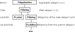
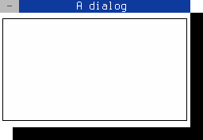

Getting Started with the FINAL CUT Widget Toolkit
=================================================

Table of Contents
-----------------

<!-- TOC -->
- [Basic functions](#basic-functions)
- [Widgets](#widgets)
- [Widget tree](#widget-tree)
- [Using the library](#how-to-use-the-library)
  - [Example code](#example-code)
  - [Compiling](#how-to-compile-this-example)
    - [Manually compile](#manually-compile-the-application)
    - [compile with pkg-config](#use-pkg-config-to-compile-the-application)
    - [compile with GNU Autotools](#use-the-gnu-Autotools-to-compile-the-application)
    - [compile with CMake](#use-cmake-to-compile-the-application)
  - [How it works](#how-it-works)
<!-- /TOC -->


Basic functions
---------------

FINAL CUT is a library for creating text-based terminal applications.
It runs on several Unix-like platforms. The release of FINAL CUT is
licensed under the terms of the GNU Lesser General Public License v3.0
([GNU LGPL v3](https://www.gnu.org/licenses/lgpl-3.0-standalone.html)),
which allows flexible licensing of applications. FINAL CUT was written
in the programming language [C++](https://en.wikipedia.org/wiki/C%2B%2B).
The object-oriented design allows the creation of fast and lean programs.

FINAL CUT is a [widget toolkit](http://en.wikipedia.org/wiki/Widget_toolkit).
A user interface usually consists of several
[widgets](https://en.wikipedia.org/wiki/Software_widget). FINAL CUT
draws widgets on virtual windows and then mapped them on a virtual
terminal. It uses the terminal capabilities from the
[Termcap library](https://en.wikipedia.org/wiki/Termcap) to display
the character matrix of the virtual terminal on the screen or a terminal
emulator. It uses various optimization methods to improve the drawing speed.

<figure class="image">
  
  <figcaption>Figure 1.  Structure of a FINAL CUT application</figcaption>
</figure>
<br /><br />


Widgets
-------

FINAL CUT has many widgets. It offers buttons, input fields, menus, and 
dialog boxes that cover the most common use cases. Widgets are visual 
elements that are combined to create user interfaces. Own widgets can be 
easily created by creating a derived class of `FWidget` or other existing 
widgets. All widgets are instances of 
[FWidget](https://codedocs.xyz/gansm/finalcut/classfinalcut_1_1FWidget.html) 
or its subclasses.

A widget can contain any number of child widgets. Child widgets are displayed 
in the display area of the parent widget. Window widgets based on `FWindow` 
have their own virtual display area and are independent of the parent widget.

When a parent widget is disabled, hidden, or deleted, the same operation is 
used recursively to all its child widgets. The base class `FObject` implements 
the self-organized object tree behavior. For example, `addChild()` removes 
the child ownership from an existing parent object before assigning it to 
the new target. When a child becomes deleted, the parent-child relationship 
causes its reference in the parent object to be removed. An explicit 
`delChild()` is no longer required here.


Widget tree
-----------

An `FApplication` widget is the top-level widget of an application. It is 
unique and can not have a parent widget. The class `FApplication` manages 
all settings and assigns keyboard and mouse input to the different widgets.

<figure class="image">
  
  <figcaption>Figure 2.  Widget tree of a FINAL CUT application</figcaption>
</figure>
<br /><br />

The main widget of a FINAL CUT application is the only object that 
`FApplication` can have as a child. This main widget is usually a window 
object that contains all sub-widgets of the application. A sub-widget can 
also be another window.


How to use the library
----------------------

### Example code

This introduction to FINAL CUT begins with a brief example.

The following example demonstrates how to create an empty dialog box
with dimensions of 30 by 10 characters.

**File:** *dialog.cpp*
```cpp
#include <final/final.h>

auto main (int argc, char* argv[]) -> int
{
  finalcut::FApplication app(argc, argv);
  finalcut::FDialog dialog(&app);
  dialog.setText ("A dialog");
  const finalcut::FPoint position{25, 5};
  const finalcut::FSize size{30, 10};
  dialog.setGeometry (position, size);
  finalcut::FWidget::setMainWidget(&dialog);
  dialog.show();
  return app.exec();
}
```
<figure class="image">
  
  <figcaption>Figure 3.  A blank dialog</figcaption>
</figure>
<br /><br />
> [!NOTE]
> You can close the dialog with the mouse, 
> <kbd>Shift</kbd>+<kbd>F10</kbd> or <kbd>Ctrl</kbd>+<kbd>^</kbd>


### How to compile this example

> [!IMPORTANT]
> Before continuing, ensure that FINAL CUT, all required 
> [dependencies](doc/faq.md#what-do-i-need-to-build-this-library), 
> and a C++ compiler are installed.

To compile a FINAL CUT application, specify the locations of the header
files and the FINAL CUT library. Build tools such as
[GNU Autotools](https://en.wikipedia.org/wiki/GNU_Autotools) or
[CMake](https://en.wikipedia.org/wiki/CMake) can automate this
configuration. These requirements also apply when integrating FINAL CUT
into your own projects.


#### Manually compile the application

Step 1: Verify that FINAL CUT is installed. The header files should be 
located in the standard include directory, and the library should be 
located in one of the library search paths on your system.

Step 2: Save the source code file as *dialog.cpp* to continue with the
compilation.

Step 3: Use the following command to compile the code with the GNU
Compiler Collection (GCC):
```bash
g++ dialog.cpp -o my-dialog -O2 -lfinal
```
Run the application using the following command:
```bash
./my-dialog
```


#### Use pkg-config to compile the application

The following command demonstrates compilation of the source file using
GCC and [pkg-config](https://de.wikipedia.org/wiki/Pkg-config). Ensure
the current directory contains the source code file.
```bash
g++ dialog.cpp -o my-dialog `pkg-config --libs finalcut`
```
The executable application *my-dialog* is now generated.


#### Use the GNU Autotools to compile the application

Follow the GNU Automake instructions as outlined below.

**File:** *Makefile.am*
```make
LDADD = -lfinal
bin_PROGRAMS = my-dialog
my_dialog_SOURCES = dialog.cpp
```

Create a *configure.ac* template that includes the required GNU autoconf
M4 macros.

**File:** *configure.ac*
```m4
AC_INIT([my-dialog], [1.0])
AM_INIT_AUTOMAKE([foreign])
AC_PROG_CC
AC_PROG_CXX
AC_PROG_INSTALL
AC_CONFIG_FILES([Makefile])
AC_OUTPUT

AC_CHECK_LIB([final],
             [main],
             [],
             [AC_MSG_ERROR([libfinal not found!])])
```

Initiate the build system with the following command:
```bash
autoreconf --install
```

Execute the configure script:
```bash
./configure
```

Build the executable application using the following command:
```bash
make
```
The executable application *my-dialog* is now generated.
						

#### Use CMake to compile the application

Follow the CMake instruction file as outlined below.

**File:** *CMakeLists.txt*
```cmake
cmake_minimum_required(VERSION 3.12)
project(my-dialog)
list(APPEND CMAKE_MODULE_PATH "${PROJECT_SOURCE_DIR}/cmake/Modules")
find_package(finalcut REQUIRED)
add_executable(my-dialog dialog.cpp)
target_link_libraries(my-dialog PRIVATE finalcut::libfinal)
```

> [!NOTE]
> If CMake does not locate the package file (*FindFinalCut.cmake*) on
> the system, copy it from the FINAL CUT source directory to the local
> CMake directory.
> ```bash
> mkdir cmake/Modules
> cp {finalcut-source-directory}/Findfinalcut.cmake cmake/Modules/
> ```


Create a build directory and change to it:
```bash
mkdir build && cd build
```

Run cmake with the source directory as an argument:
```bash
cmake ..
```

Build the executable application using the following command:
```bash
mak	e
```
The executable application *my-dialog* is now generated.


### How it works

```cpp
#include <final/final.h>
```
All final cut programs have to include the *final.h* header.

```cpp
finalcut::FApplication app(argc, argv);
```
This line creates the `finalcut::FApplication` object `app` with
the command line arguments `argc` and `argv`. This object manages
the application main event loop. It receives keyboard and mouse events
and sends them to the target widgets. You have to create an application
object before you can create a widgets object.

The next line
```cpp
finalcut::FDialog dialog(&app);
```
creates the `finalcut::FDialog` object `dialog` with the object `app`
as parent object. The `finalcut::FDialog` class is the base class for
creating dialog windows.

```cpp
dialog.setText ("A dialog");
```
The title bar of the dialog box gets the text "A dialog".

```cpp
finalcut::FPoint position{25, 5};
finalcut::FSize size{30, 10};
dialog.setGeometry (position, size);
```
The dialog window gets a width of 30 and a height of 10 characters.
The position of the window in the terminal is at x=25 and
y=5.

> [!NOTE]
> x=1 and y=1 represents the upper left corner.

```cpp
finalcut::FWidget::setMainWidget(&dialog);
```
The `dialog` object was now selected as the main widget for the application.
When you close the main widget, the entire application quits.


```cpp
dialog.show();
```
A window or widget is not visible directly after its creation.
Only the call of `show()` makes it (and its child objects,
if available) visible.

```cpp
return app.exec();
```
The last line calls `exec()` to start the application and to return
the result to the operating system. The started application enters
the main event loop. This loop does not end until the window is
closed.
