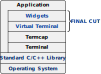
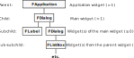
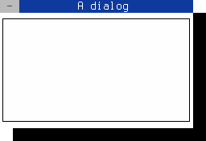

Getting Started with the FINAL CUT Widget Toolkit
=================================================

Table of Contents
-----------------

<!-- TOC -->
- [Basic functions](#basic-functions)
- [Widgets](#widgets)
- [Widget tree](#widget-tree)
- [Using the library](#how-to-use-the-library)
  - [Example code](#example-code)
  - [Compiling](#how-to-compile-this-example)
    - [Building manually](#building-the-application-manually)
    - [Compiling with pkg-config](#use-pkg-config-to-compile-the-application)
    - [Compiling with GNU Autotools](#use-gnu-Autotools-to-compile-the-application)
    - [Compiling with CMake](#use-cmake-to-compile-the-application)
  - [How it works](#how-it-works)
<!-- /TOC -->


Basic functions
---------------

FINAL CUT is a library for creating text-based terminal applications.
It runs on several Unix-like platforms. FINAL CUT is released under 
the terms of the GNU Lesser General Public License v3.0
([GNU LGPL v3](https://www.gnu.org/licenses/lgpl-3.0-standalone.html)),
which allows flexible licensing of applications. FINAL CUT was written
in the programming language [C++](https://en.wikipedia.org/wiki/C%2B%2B).
Its object-oriented design makes it easy to build fast, lean applications.

FINAL CUT is a [widget toolkit](http://en.wikipedia.org/wiki/Widget_toolkit).
A user interface usually consists of several
[widgets](https://en.wikipedia.org/wiki/Software_widget). FINAL CUT
draws widgets on virtual windows and then maps them to a virtual
terminal. It uses the terminal capabilities from the
[Termcap library](https://en.wikipedia.org/wiki/Termcap) to display
the character matrix of the virtual terminal on the screen or a terminal
emulator. It uses various optimization methods to improve the drawing speed.

<figure class="image">
  
  <figcaption>Figure 1:  Structure of a FINAL CUT application</figcaption>
</figure>
<br /><br />


Widgets
-------

FINAL CUT has many widgets. It offers buttons, input fields, menus, and
various window types and panels for different use cases. Widgets are visual 
elements that are combined to create user interfaces. You can easily create 
your custom widgets by creating a derived class of `FWidget` or other existing 
widgets. All widgets are instances of 
[FWidget](https://codedocs.xyz/gansm/finalcut/classfinalcut_1_1FWidget.html) 
or its subclasses.

A widget can contain any number of child widgets. Child widgets are displayed 
in the display area of the parent widget. However, `FWindow`-based window
widgets have their own virtual display area and operate independently of
the parent widget.

Disabling, hiding, or deleting a parent widget automatically affects all 
child widgets. This hierarchical behavior is handled by the `FObject` base 
class. For example, `addChild()` removes the child ownership from an existing 
parent object before assigning it to the new target. When a child is deleted, 
the parent-child relationship causes its reference in the parent object to be 
removed. An explicit `delChild()` is no longer required here.


Widget tree
-----------

The `FApplication` widget is the root of the application. A root object cannot
have parent widgets. The class `FApplication` manages 
all settings and assigns keyboard and mouse input to the different widgets.

<figure class="image">
  
  <figcaption>Figure 2:  Widget tree of a FINAL CUT application</figcaption>
</figure>
<br /><br />

Only one main widget can be assigned as a child to the `FApplication`
instance. This main widget is usually a window object that contains all
child widgets of the application. A child widget can also be another
window.


How to use the library
----------------------

### Example code

This introduction to FINAL CUT begins with a brief example.

The following example demonstrates how to create an empty dialog box
with dimensions of 30 by 10 characters.

**File:** *dialog.cpp*
```cpp
#include <final/final.h>

auto main (int argc, char* argv[]) -> int
{
  finalcut::FApplication app(argc, argv);
  finalcut::FDialog dialog(&app);
  dialog.setText ("A dialog");
  const finalcut::FPoint position{25, 5};
  const finalcut::FSize size{30, 10};
  dialog.setGeometry (position, size);
  finalcut::FWidget::setMainWidget(&dialog);
  dialog.show();
  return app.exec();
}
```
<figure class="image">
  
  <figcaption>Figure 3:  A blank dialog</figcaption>
</figure>
<br /><br />
> [!NOTE]
> You can close the dialog with the mouse, 
> <kbd>Shift</kbd>+<kbd>F10</kbd> or <kbd>Ctrl</kbd>+<kbd>^</kbd>


### How to compile this example

> [!IMPORTANT]
> Before continuing, ensure that FINAL CUT, all required 
> [dependencies](faq.md#what-do-i-need-to-build-this-library), 
> and a C++ compiler are installed.

To compile a FINAL CUT application, specify the locations of the header
files and the FINAL CUT library. Build tools such as
[GNU Autotools](https://en.wikipedia.org/wiki/GNU_Autotools) or
[CMake](https://en.wikipedia.org/wiki/CMake) can automate this
configuration. These requirements also apply when integrating FINAL CUT
into your own projects.


#### Building the application manually

1. Check dependencies:<br />
   Make sure FINAL CUT is installed. You'll need the header files in your 
   standard include directory and the library file in your system's library 
   path.

2. Save the source:<br />
   Save the code as *dialog.cpp* to get started.

3. Compile and run:<br />
   Use g++ to build the executable:<br />
   ```bash
   g++ dialog.cpp -o my-dialog -O2 -lfinal
   ```
   After building, run it with:
   ```bash
   ./my-dialog
   ```


#### Use pkg-config to compile the application

Compile the source file using GCC and
[pkg-config](https://en.wikipedia.org/wiki/Pkg-config) with this
command. Ensure the current directory contains the source code file.
```bash
g++ dialog.cpp -o my-dialog `pkg-config --libs finalcut`
```
You can now run the *my-dialog* executable.


#### Use GNU Autotools to compile the application

Follow the GNU Automake instructions as outlined below.

**File:** *Makefile.am*
```make
LDADD = -lfinal
bin_PROGRAMS = my-dialog
my_dialog_SOURCES = dialog.cpp
```

Create a *configure.ac* template that includes the required GNU autoconf
M4 macros.

**File:** *configure.ac*
```m4
AC_INIT([my-dialog], [1.0])
AM_INIT_AUTOMAKE([foreign])
AC_PROG_CC
AC_PROG_CXX
AC_PROG_INSTALL
AC_CONFIG_FILES([Makefile])
AC_OUTPUT

AC_CHECK_LIB([final],
             [main],
             [],
             [AC_MSG_ERROR([libfinal not found!])])
```

Initialize the build system with:
```bash
autoreconf --install
```

Execute the configure script:
```bash
./configure
```

Build the executable application using the following command:
```bash
make
```
The executable (*my-dialog*) is created.
						

#### Use CMake to compile the application

Follow the CMake build script as outlined below.

**File:** *CMakeLists.txt*
```cmake
cmake_minimum_required(VERSION 3.12)
project(my-dialog)
list(APPEND CMAKE_MODULE_PATH "${PROJECT_SOURCE_DIR}/cmake/Modules")
find_package(finalcut REQUIRED)
add_executable(my-dialog dialog.cpp)
target_link_libraries(my-dialog PRIVATE finalcut::libfinal)
```

> [!NOTE]
> If CMake does not locate the package file (*FindFinalCut.cmake*) on
> the system, copy it from the FINAL CUT source directory to the local
> CMake directory.
> ```bash
> mkdir cmake/Modules
> cp {finalcut-source-directory}/Findfinalcut.cmake cmake/Modules/
> ```


Create a build directory and change to it:
```bash
mkdir build && cd build
```

Run cmake with the source directory as an argument:
```bash
cmake ..
```

Build the application using the following command:
```bash
make
```
The executable (*my-dialog*) is created.


### How it works

```cpp
#include <final/final.h>
```
All FINAL CUT programs require the header *final.h*.

```cpp
finalcut::FApplication app(argc, argv);
```
Initialize the `finalcut::FApplication` object `app` by passing 
the command line arguments `argc` and `argv`. This object manages 
the main event loop  of the application. It receives keyboard and mouse 
events and sends them to the target widgets. You must create an application
object before you can create a widget.

> [!NOTE]
> **Command line arguments**
> 
> All FINAL CUT applications support the predefined command-line arguments.
> 
> | Option                     | Description               |
> | :------------------------- | :------------------------ |
> | -h, --help                 | Display the help options  |
> | --encoding=*&lt;MODE&gt;*  | Sets the character encoding mode.<br />*&lt;MODE&gt;* can be one of *utf8*, *vt100*, *pc* or *ascii* |
> | --log-file=*&lt;FILE&gt;*  | Writes log output to the file *&lt;FILE&gt;*.<br /> `std::clog << "A debug message\n";` creates a log line in this file. To view the output in another terminal, run `tail -f <FILE>`.|
> | --no-mouse                 | Disable mouse support |
> | --no-optimized-cursor      | Disable cursor optimization |
> | --no-terminal-detection    | Disable terminal detection |
> | --no-terminal-data-request | Do not determine terminal font and title |
> | --no-terminal-focus-events | Do not send focus-in and focus-out events |
> | --no-color-change          | Do not redefine the color palette |
> | --no-sgr-optimizer         | Do not optimize SGR sequences |
> | --vgafont                  | Set standard vga 8x16 font |
> | --newfont                  | Enables graphical font |
> | --dark-theme               | Enables dark theme |

This line
```cpp
finalcut::FDialog dialog(&app);
```
creates the `finalcut::FDialog` object `dialog` using the `app`
object as the parent. The `finalcut::FDialog` class is the base class for
creating dialog windows.

```cpp
dialog.setText ("A dialog");
```
This sets the dialog box title to "A dialog".

```cpp
finalcut::FPoint position{25, 5};
finalcut::FSize size{30, 10};
dialog.setGeometry (position, size);
```
This sets the dialog to a width of 30 characters and a height of 10.
The position of the window in the terminal is at x = 25 and
y = 5.

> [!NOTE]
> x=1 and y=1 represents the upper left corner.

```cpp
finalcut::FWidget::setMainWidget(&dialog);
```
Set the `dialog` as the application's main widget. When you close
the main widget, the entire application quits.


```cpp
dialog.show();
```
Widgets are not visible by default when created.
Calling `show()` makes it (and its child objects
if available) visible.

```cpp
return app.exec();
```
The last line calls `exec()` to start the application and return
the result to the operating system. The return value can be
EXIT_SUCCESS (0), EXIT_FAILURE (1), or any other value specified by
`FApplication::exit(int retcode)`. The application then enters its
[main event loop](event-processing.md#event-processing), processing all
events, including user interactions with the TUI, until the window closes.

> [!NOTE]
> Each FINAL CUT application has exactly one main event loop.
