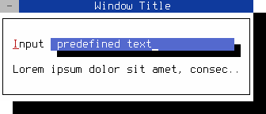

Memory Management
=================

To create a hierarchy of FObjects (or derived classes and widgets),
initialize each new FObject with its parent object.

```cpp
FObject* parent = new FObject();
FObject* child  = new FObject(parent);
```

When a parent FObject is deleted, its child objects are automatically
deallocated.

You can also assign a child to another object later using `addChild()`.

```cpp
FObject* parent = new FObject();
FObject* child = new FObject();
parent->addChild(child);
```

To remove a child object from its parent at any time, use `delChild()`.

```cpp
FObject* parent = new FObject();
FObject* child  = new FObject(parent);
parent->delChild(child);
```

If an FObject with a parent is removed from the hierarchy, its 
destructor automatically updates the parent object. If a class 
does not derive from FObject, you must manage its memory allocation 
manually.

**File:** *memory.cpp*
```cpp
#include <final/final.h>

using namespace finalcut;

auto main (int argc, char* argv[]) -> int
{
  FApplication app(argc, argv);

  // The dialog object is managed by the app object
  FDialog* dialog = new FDialog(&app);
  dialog->setText ("Window Title");
  dialog->setGeometry (FPoint{25, 5}, FSize{40, 8});

  // The input object is managed by the dialog object
  FLineEdit* input = new FLineEdit("predefined text", dialog);
  input->setGeometry(FPoint{8, 2}, FSize{29, 1});
  input->setLabelText (L"&Input");

  // The label object is managed by the dialog object
  FLabel* label = new FLabel ( "Lorem ipsum dolor sit amet, consectetur "
                               "adipiscing elit, sed do eiusmod tempor "
                               "incididunt ut labore et dolore magna aliqua."
                             , dialog );
  label->setGeometry (FPoint{2, 4}, FSize{36, 1});
  FWidget::setMainWidget(dialog);
  dialog->show();
  return app.exec();
}
```
<figure class="image">
  
  <figcaption>Figure 1:  FObject manages its child objects</figcaption>
</figure>
<br /><br />

> [!NOTE]
> To close the dialog, use the mouse or press 
> <kbd>Shift</kbd>+<kbd>F10</kbd> or <kbd>Ctrl</kbd>+<kbd>^</kbd>

Save the code as *memory.cpp* and compile it using the following GCC
command:
```bash
g++ memory.cpp -o memory -O2 -lfinal
```
