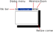

Title bar actions on mouse clicks
=================================

The FINAL CUT title bar of dialog windows has different behaviors on mouse clicks.

 

Clicking on the title bar
-------------------------

* A left-click activates and raises the window. After that, you can drag the window with the mouse.
* A middle-click activates and lower the window.
* A right-click activates the window and keeps its current position in the window stack.
* A double-click maximizes or restores the window size for a resizable dialog.

Clicking the title bar buttons
------------------------------

* Single-clicking on the title bar menu button opens the title bar menu.
* Double-clicking on the title bar menu button closes the dialog.
* Single-clicking on the minimize button minimizes the window.
* Single-clicking on the zoom button maximizes the window size.
* Single-clicking on the unzoom button restores the window size.

Dialog resize corner
--------------------

If you click and drag the left mouse button in the lower right corner of the window, you can change the size of a resizable dialog.

