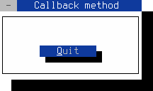

Signals and Callbacks
=====================

Table of Contents
-----------------

<!-- TOC -->
- [Callbacks](#dynamic-object-binding-via-callbacks)
- [Default signals](#the-final-cut-widgets-emit-the-following-default-signals)
- [Callback function](#example-of-a-callback-function)
- [Callback lambda expression](#example-of-an-lambda-expression-callback)
- [Callback method](#example-of-a-callback-method)
- [Custom signals](#send-custom-signals)
<!-- /TOC -->


Dynamic object binding via callbacks
------------------------------------

The callback mechanism is essential for developing applications with 
FINAL CUT. Callback routines allow the programmer to connect different 
objects (which do not need to know each other). Connected objects notify 
each other when an action occurs in a widget. To uniquely identify a widget 
action, it uses signal strings. For example, if an `FButton` object gets 
clicked by a keyboard or mouse, it sends the string "clicked". A signal 
handler explicitly provided by Widget, in the form of a callback function 
or a callback method, can react to such a signal.

A callback function has no return value and can have various arguments:

```cpp
void cb_function (FWidget* w, int* i, double* d, ...)
{...}
```

The structure of a callback method is the same:

```cpp
void classname::cb_methode (FWidget* w, int* i, double* d, ...)
{...}
```

We use the `addCallback()` method of the `FWidget` class to connect 
to other widget objects.

1. For calling functions or static methods via a pointer:

```cpp
template< typename Function
        , typename FunctionPointer<Function>::type = nullptr
        , typename... Args >
void FWidget::addCallback ( const FString& cb_signal
                          , Function&&     cb_function
                          , Args&&...      args)
{...}
```

2. For calling functions or static methods via a reference:

```cpp
template< typename Function
        , typename FunctionReference<Function>::type = nullptr
        , typename... Args >
void FWidget::addCallback ( const FString& cb_signal
                          , Function&      cb_function
                          , Args&&...      args)
{...}
```

3. For calling a member method of a specific instance:

```cpp
template< typename Object
        , typename Function
        , typename ObjectPointer<Object>::type = nullptr
        , typename MemberFunctionPointer<Function>::type = nullptr
        , typename... Args >
void FWidget::addCallback ( const FString& cb_signal
                          , Object&&       cb_instance
                          , Function&&     cb_member
                          , Args&&...      args)
{...}
```

4. For calling a std::bind call wrapper or a lambda expression:
```cpp
template< typename Function
        , typename ClassObject<Function>::type = nullptr
        , typename... Args >
void FWidget::addCallback ( const FString& cb_signal
                          , Function&&     cb_function
                          , Args&&...      args)
{...}
```

5. For calling a std::bind call wrapper to a specific instance:

```cpp
template< typename Object
        , typename Function
        , typename ObjectPointer<Object>::type = nullptr
        , typename ClassObject<Function>::type = nullptr
        , typename... Args >
void FWidget::addCallback ( const FString& cb_signal
                          , Object&&       cb_instance
                          , Function&&     cb_function
                          , Args&&...      args)
{...}
```

6. For calling a lambda function that has been stored in a variable
with the keyword auto:

```cpp
template< typename Function
        , typename ClassObject<Function>::type = nullptr
        , typename... Args >
void FWidget::addCallback ( const FString& cb_signal
                          , Function&      cb_function
                          , Args&&...      args)
{...}
```

With `delCallback(...)` you can remove a connection to a signal handler
or a widget instance. Alternatively, you can use `delCallbacks()` to
remove all existing callbacks from an object.

1. To delete functions or static methods callbacks via a pointer:

```cpp
template< typename FunctionPtr
        , typename FunctionPointer<FunctionPtr>::type = nullptr >
void FWidget::delCallback (FunctionPtr&& cb_func_ptr)
{...}
```

2. To delete functions or static methods callbacks via a reference:

```cpp
template< typename Function
        , typename FunctionReference<Function>::type = nullptr >
void FWidget::delCallback (Function& cb_function)
{...}
```

3. To delete all callbacks from a specific instance:

```cpp
template< typename Object
        , typename ObjectPointer<Object>::type = nullptr >
void FWidget::delCallback (Object&& cb_instance)
{...}
```

4. To delete all callbacks of a signal:

```cpp
void delCallback (const FString& cb_signal)
{...}
```

5. To delete all callbacks of a signal and specific instance:

```cpp
template< typename Object
        , typename ObjectPointer<Object>::type = nullptr >
void delCallback (const FString& cb_signal, Object&& cb_instance)
{...}
```

6. To delete all callbacks from a widget:

```cpp
void delCallback()
{...}
```


The FINAL CUT widgets emit the following default signals
--------------------------------------------------------

<dl>
  <dt>FApplication</dt>
  <dd>"first-dialog-opened"<br />"last-dialog-closed"</dd>

  <dt>FButton</dt>
  <dd>"clicked"</dd>

  <dt>FCheckMenuItem</dt>
  <dd>"clicked"<br />"toggled"</dd>

  <dt>FLineEdit</dt>
  <dd>"activate"<br />"changed"</dd>

  <dt>FListBox</dt>
  <dd>"changed"<br />"clicked"<br />"row-changed"<br />"row-selected"</dd>

  <dt>FListView</dt>
  <dd>"changed"<br />"clicked"<br />"row-changed"</dd>

  <dt>FMenu</dt>
  <dd>"activate"</dd>

  <dt>FMenuItem</dt>
  <dd>"activate"<br />"clicked"<br />"deactivate"</dd>

  <dt>FRadioMenuItem</dt>
  <dd>"clicked"<br />"toggled"</dd>

  <dt>FScrollbar</dt>
  <dd>"change-value"</dd>

  <dt>FSpinBox</dt>
  <dd>"changed"</dd>

  <dt>FStatusBar</dt>
  <dd>"activate"</dd>

  <dt>FTextView</dt>
  <dd>"changed"</dd>

  <dt>FToggleButton</dt>
  <dd>"clicked"<br />"toggled"</dd>

  <dt>FWidget</dt>
  <dd>"destroy"<br />"enable"<br />"disable"<br />"focus-in"<br />"focus-out"<br />"mouse-press"<br />"mouse-release"<br />"mouse-move"<br />"mouse-wheel-down"<br />"mouse-wheel-up"</dd>
</dl>

&nbsp;

Example of a callback function:
-------------------------------

**File:** *callback-function.cpp*

```cpp
#include <final/final.h>

using namespace finalcut;

void cb_changeText (const FButton& button, FLabel& label)
{
  label.clear();
  label << "The " << button.getClassName() << " was pressed";
  label.redraw();
}

auto main (int argc, char* argv[]) -> int
{
  FApplication app(argc, argv);
  FDialog dialog(&app);
  dialog.setText ("A dialog with callback function");
  dialog.setGeometry (FRect{25, 5, 45, 9});
  FLabel label (&dialog);
  label = "The button has never been pressed before";
  label.setGeometry (FPoint{2, 2}, FSize{41, 1});
  FButton button (&dialog);
  // Character follows '&' will be used as the accelerator key
  button = "&Click me";
  button.setGeometry (FPoint{15, 5}, FSize{14, 1});

  // Connect the button signal "clicked" with the callback function
  button.addCallback
  (
    "clicked",          // Callback signal
    &cb_changeText,     // Function pointer
    std::cref(button),  // First function argument
    std::ref(label)     // Second function argument
  );

  FWidget::setMainWidget(&dialog);
  dialog.show();
  return app.exec();
}
```
<figure class="image">
  
  <figcaption>Figure 7.  Button with a callback function</figcaption>
</figure>
<br /><br />

> [!NOTE]
> You can close the dialog with the mouse, 
> <kbd>Shift</kbd>+<kbd>F10</kbd> or <kbd>Ctrl</kbd>+<kbd>^</kbd>


After entering the source code in *callback-function.cpp* you can compile
the above program with gcc:
```bash
g++ callback-function.cpp -o callback-function -O2 -lfinal
```
&nbsp;

Example of an lambda expression callback:
-----------------------------------------

**File:** *callback-lambda.cpp*

```cpp
#include <final/final.h>

using namespace finalcut;

auto main (int argc, char* argv[]) -> int
{
  FApplication app(argc, argv);
  FDialog dialog(&app);
  dialog.setText ("Lambda expression as callback");
  dialog.setGeometry (FRect{25, 5, 45, 9});
  FButton button ("&bottom", &dialog);
  button.setGeometry (FPoint{15, 5}, FSize{14, 1});

  // Connect the button signal "clicked" with the lambda expression
  button.addCallback
  (
    "clicked",                          // Callback signal
    [] (FButton& button, FDialog& dgl)  // Lambda function
    {
      if ( button.getY() != 2 )
      {
        button.setPos (FPoint{15, 2});
        button.setText("&top");
      }
      else
      {
        button.setPos (FPoint{15, 5});
        button.setText("&bottom");
      }

      dgl.redraw();
    },
    std::ref(button),                   // First function argument
    std::ref(dialog)                    // Second function argument
  );

  FWidget::setMainWidget(&dialog);
  dialog.show();
  return app.exec();
}
```
<figure class="image">
  
  <figcaption>Figure 8.  Button with lambda expression callback.</figcaption>
</figure>
<br /><br />

> [!NOTE]
> You can close the dialog with the mouse, 
> <kbd>Shift</kbd>+<kbd>F10</kbd> or <kbd>Ctrl</kbd>+<kbd>^</kbd>


After entering the source code in *callback-lambda.cpp* you can compile
the above program with gcc:
```bash
g++ callback-lambda.cpp -o callback-lambda -O2 -lfinal -std=c++14
```
&nbsp;

Example of a callback method:
-----------------------------

**File:** *callback-method.cpp*

```cpp
#include <final/final.h>

using namespace finalcut;

class dialogWidget : public FDialog
{
  public:
    explicit dialogWidget (FWidget* parent = nullptr)
      : FDialog{parent}
    {
      // Connect the button signal "clicked" with the callback method
      button.addCallback
      (
        "clicked",                            // Callback signal
        finalcut::getFApplication(),          // Class instance
        &finalcut::FApplication::cb_exitApp,  // Method pointer
        this                                  // Function argument
      );
    }

  private:
    void initLayout()
    {
      setText ("Callback method");
      setGeometry (FPoint{25, 5}, FSize{25, 7});
      button.setGeometry (FPoint{7, 3}, FSize{10, 1});
      FDialog::initLayout();
    }

    FButton button{"&Quit", this};
};

auto main (int argc, char* argv[]) -> int
{
  FApplication app(argc, argv);
  dialogWidget dialog(&app);
  FWidget::setMainWidget(&dialog);
  dialog.show();
  return app.exec();
}
```
<figure class="image">
  
  <figcaption>Figure 9.  Button with a callback method</figcaption>
</figure>
<br /><br />

> [!NOTE]
> You can close the dialog with the mouse, 
> <kbd>Shift</kbd>+<kbd>F10</kbd> or <kbd>Ctrl</kbd>+<kbd>^</kbd>


After entering the source code in *callback-method.cpp* you can compile
the above program with gcc:
```bash
g++ callback-method.cpp -o callback-method -O2 -lfinal -std=c++14
```
&nbsp;


Send custom signals
-------------------

You can use the `emitCallback()` method to generate a user-defined signal. 
You can connect this signal later with the method `addCallback()` to a 
self-defined routine.

**File:** *emit-signal.cpp*
```cpp
#include <final/final.h>

using namespace finalcut;

class dialogWidget : public FDialog
{
  public:
    explicit dialogWidget (FWidget* parent = nullptr)
      : FDialog{parent}
    {
      label.setAlignment (Align::Right);
      label.setForegroundColor (FColor::Black);
      plus.setNoUnderline();
      minus.setNoUnderline();

      // Connect the button signal "clicked" with the callback method
      plus.addCallback ("clicked", this, &dialogWidget::cb_plus);
      minus.addCallback ("clicked", this, &dialogWidget::cb_minus);

      // Connect own signals
      addCallback ("hot", this, &dialogWidget::cb_set_red);
      addCallback ("regular", this, &dialogWidget::cb_set_black);
      addCallback ("cold", this, &dialogWidget::cb_set_blue);
    }

  private:
    void initLayout()
    {
      setGeometry (FPoint{25, 5}, FSize{22, 7});
      setText ("Emit signal");
      const FSize size{5, 1};
      label.setGeometry (FPoint{8, 1}, size);
      plus.setGeometry (FPoint{3, 3}, size);
      minus.setGeometry (FPoint{3, 3} + FPoint{10, 0}, size);
      FDialog::initLayout();
    }

    void cb_plus()
    {
      if ( t < 100 )
        t++;

      if ( t == 30 )
        emitCallback("hot");
      else if ( t == 1 )
        emitCallback("regular");

      setTemperature();
    }

    void cb_minus()
    {
      if ( t > -99 )
        t--;

      if ( t == 0 )
        emitCallback("cold");
      else if ( t == 29 )
        emitCallback("regular");

      setTemperature();
    }

    void cb_set_blue()
    {
      label.setForegroundColor (FColor::Blue);
    }

    void cb_set_black()
    {
      label.setForegroundColor (FColor::Black);
    }

    void cb_set_red()
    {
      label.setForegroundColor (FColor::Red);
    }

    void setTemperature()
    {
      label.clear();
      label << t << "°C";
      label.redraw();
    }

    int t = 20;
    FLabel label{std::move(FString() << t << "°C"), this};
    FButton plus {"&+", this};
    FButton minus {"&-", this};
};

auto main (int argc, char* argv[]) -> int
{
  FApplication app(argc, argv);
  dialogWidget dialog(&app);
  FWidget::setMainWidget(&dialog);
  dialog.show();
  return app.exec();
}
```
<figure class="image">
  
  <figcaption>Figure 10.  Callbacks with custom signals</figcaption>
</figure>
<br /><br />

> [!NOTE]
> You can close the dialog with the mouse, 
> <kbd>Shift</kbd>+<kbd>F10</kbd> or <kbd>Ctrl</kbd>+<kbd>^</kbd>


After entering the source code in *emit-signal.cpp* you can compile
the above program with gcc:
```bash
g++ emit-signal.cpp -o emit-signal -O2 -lfinal -std=c++14
```
