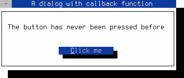
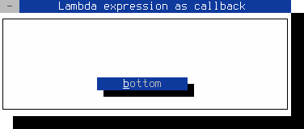
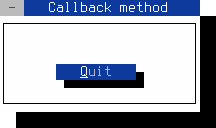
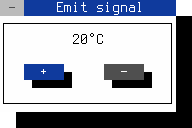

Signals and Callbacks
=====================

Table of Contents
-----------------

<!-- toc -->
- [Callbacks](#dynamic-object-binding-via-callbacks)
- [Default Signals](#default-signals-emitted-by-final-cut-widgets)
- [Callback Function](#function-example)
- [Callback Lambda Expression](#lambda-expression-example)
- [Callback Method](#method-example)
- [Custom Signals](#sending-custom-signals)
<!-- endtoc -->


Dynamically binding objects using callbacks
-------------------------------------------

The callback mechanism is essential for developing applications with 
FINAL CUT. Callback routines allow the programmer to connect different
objects without them needing to know each other. Connected objects
inform each other when an action occurs on a widget. The framework uses
signal strings to uniquely identify widget actions. For example, when
an `FButton` is clicked using a mouse or a keyboard, it emits the string 
"clicked". A dedicated callback function or method processes this signal.

A callback function does not return a value and can have various
arguments:

```cpp
void cb_function (FWidget* w, int* i, double* d, ...)
{...}
```

A callback method has the same signature:

```cpp
void ClassName::cb_method (FWidget* w, int* i, double* d, ...)
{...}
```

We use the `addCallback()` method of the `FWidget` class to bind widgets 
together.

1. To call functions or static methods using a pointer:

```cpp
template< typename Function
        , typename FunctionPointer<Function>::type = nullptr
        , typename... Args >
void FWidget::addCallback ( const FString& cb_signal
                          , Function&&     cb_function
                          , Args&&...      args)
{...}
```

2. To call functions or static methods via a reference:

```cpp
template< typename Function
        , typename FunctionReference<Function>::type = nullptr
        , typename... Args >
void FWidget::addCallback ( const FString& cb_signal
                          , Function&      cb_function
                          , Args&&...      args)
{...}
```

3. To call a member method of a specific instance:

```cpp
template< typename Object
        , typename Function
        , typename ObjectPointer<Object>::type = nullptr
        , typename MemberFunctionPointer<Function>::type = nullptr
        , typename... Args >
void FWidget::addCallback ( const FString& cb_signal
                          , Object&&       cb_instance
                          , Function&&     cb_member
                          , Args&&...      args)
{...}
```

4. To call a std::bind wrapper or a lambda expression:
```cpp
template< typename Function
        , typename ClassObject<Function>::type = nullptr
        , typename... Args >
void FWidget::addCallback ( const FString& cb_signal
                          , Function&&     cb_function
                          , Args&&...      args)
{...}
```

5. To call a std::bind wrapper on a specific instance:

```cpp
template< typename Object
        , typename Function
        , typename ObjectPointer<Object>::type = nullptr
        , typename ClassObject<Function>::type = nullptr
        , typename... Args >
void FWidget::addCallback ( const FString& cb_signal
                          , Object&&       cb_instance
                          , Function&&     cb_function
                          , Args&&...      args)
{...}
```

6. To call a lambda expression assigned to a variable:

```cpp
template< typename Function
        , typename ClassObject<Function>::type = nullptr
        , typename... Args >
void FWidget::addCallback ( const FString& cb_signal
                          , Function&      cb_function
                          , Args&&...      args)
{...}
```

You can remove a connection to a signal handler or a widget instance 
with `delCallback(...)`. Alternatively, you can use `delCallbacks()` 
to remove all existing callbacks from an object.

1. To delete callbacks of functions or static methods via a pointer:

```cpp
template< typename FunctionPtr
        , typename FunctionPointer<FunctionPtr>::type = nullptr >
void FWidget::delCallback (FunctionPtr&& cb_func_ptr)
{...}
```

2. To delete callbacks of functions or static methods via a reference:

```cpp
template< typename Function
        , typename FunctionReference<Function>::type = nullptr >
void FWidget::delCallback (Function& cb_function)
{...}
```

3. To delete all callbacks from a specific instance:

```cpp
template< typename Object
        , typename ObjectPointer<Object>::type = nullptr >
void FWidget::delCallback (Object&& cb_instance)
{...}
```

4. To delete all callbacks of a signal:

```cpp
void delCallback (const FString& cb_signal)
{...}
```

5. To delete all callbacks of a signal and specific instance:

```cpp
template< typename Object
        , typename ObjectPointer<Object>::type = nullptr >
void delCallback (const FString& cb_signal, Object&& cb_instance)
{...}
```

6. To delete all callbacks from a widget:

```cpp
void delCallback()
{...}
```


Default signals emitted by FINAL CUT widgets
--------------------------------------------

<dl>
  <dt>FApplication</dt>
  <dd>"first-dialog-opened"<br />"last-dialog-closed"</dd>

  <dt>FButton</dt>
  <dd>"clicked"</dd>

  <dt>FCheckMenuItem</dt>
  <dd>"clicked"<br />"toggled"</dd>

  <dt>FLineEdit</dt>
  <dd>"activate"<br />"changed"</dd>

  <dt>FListBox</dt>
  <dd>"changed"<br />"clicked"<br />"row-changed"<br />"row-selected"</dd>

  <dt>FListView</dt>
  <dd>"changed"<br />"clicked"<br />"row-changed"</dd>

  <dt>FMenu</dt>
  <dd>"activate"</dd>

  <dt>FMenuItem</dt>
  <dd>"activate"<br />"clicked"<br />"deactivate"</dd>

  <dt>FRadioMenuItem</dt>
  <dd>"clicked"<br />"toggled"</dd>

  <dt>FScrollBar</dt>
  <dd>"change-value"</dd>

  <dt>FSpinBox</dt>
  <dd>"changed"</dd>

  <dt>FStatusBar</dt>
  <dd>"activate"</dd>

  <dt>FTextView</dt>
  <dd>"changed"</dd>

  <dt>FToggleButton</dt>
  <dd>"clicked"<br />"toggled"</dd>

  <dt>FWidget</dt>
  <dd>"destroy"<br />"enable"<br />"disable"<br />"focus-in"<br />"focus-out"<br />"mouse-press"<br />"mouse-release"<br />"mouse-move"<br />"mouse-wheel-down"<br />"mouse-wheel-up"</dd>
</dl>

&nbsp;

Function Example
----------------

**File:** *callback-function.cpp*

```cpp
#include <final/final.h>

using namespace finalcut;

void cb_changeText (const FButton& button, FLabel& label)
{
  label.clear();
  label << "The " << button.getClassName() << " was pressed";
  label.redraw();
}

auto main (int argc, char* argv[]) -> int
{
  FApplication app(argc, argv);
  FDialog dialog(&app);
  dialog.setText ("A dialog with callback function");
  dialog.setGeometry (FRect{25, 5, 45, 9});
  FLabel label (&dialog);
  label = "The button has never been pressed before";
  label.setGeometry (FPoint{2, 2}, FSize{41, 1});
  FButton button (&dialog);
  // The '&' prefix defines the accelerator key
  // (here the shortcut is Meta-C)
  button = "&Click me";
  button.setGeometry (FPoint{15, 5}, FSize{14, 1});

  // Connect the button signal "clicked" to the callback function
  button.addCallback
  (
    "clicked",          // Callback signal
    &cb_changeText,     // Function pointer
    std::cref(button),  // First function argument
    std::ref(label)     // Second function argument
  );

  FWidget::setMainWidget(&dialog);
  dialog.show();
  return app.exec();
}
```
<figure class="image">
  
  <figcaption>Figure 1:  Button with a callback function</figcaption>
</figure>
<br /><br />

> [!NOTE]
> To close the dialog, use the mouse or press 
> <kbd>Shift</kbd>+<kbd>F10</kbd> or <kbd>Ctrl</kbd>+<kbd>^</kbd>


Save the code as *callback-function.cpp* and compile it using the 
following command:
```bash
c++ callback-function.cpp -o callback-function -O2 -lfinal
```
&nbsp;

Lambda Expression Example
-------------------------

**File:** *callback-lambda.cpp*

```cpp
#include <final/final.h>

using namespace finalcut;

auto main (int argc, char* argv[]) -> int
{
  FApplication app(argc, argv);
  FDialog dialog(&app);
  dialog.setText ("Lambda expression as callback");
  dialog.setGeometry (FRect{25, 5, 45, 9});
  FButton button ("&bottom", &dialog);
  button.setGeometry (FPoint{15, 5}, FSize{14, 1});

  // Connect the button signal "clicked" to the lambda expression
  button.addCallback
  (
    "clicked",                          // Callback signal
    [] (FButton& button, FDialog& dgl)  // Lambda function
    {
      if ( button.getY() != 2 )
      {
        button.setPos (FPoint{15, 2});
        button.setText("&top");
      }
      else
      {
        button.setPos (FPoint{15, 5});
        button.setText("&bottom");
      }

      dgl.redraw();
    },
    std::ref(button),                   // First function argument
    std::ref(dialog)                    // Second function argument
  );

  FWidget::setMainWidget(&dialog);
  dialog.show();
  return app.exec();
}
```
<figure class="image">
  
  <figcaption>Figure 2:  Button with lambda expression callback.</figcaption>
</figure>
<br /><br />

> [!NOTE]
> To close the dialog, use the mouse or press 
> <kbd>Shift</kbd>+<kbd>F10</kbd> or <kbd>Ctrl</kbd>+<kbd>^</kbd>


Save the code as *callback-lambda.cpp* and compile it using the 
following command:
```bash
c++ callback-lambda.cpp -o callback-lambda -O2 -lfinal -std=c++14
```
&nbsp;

Method Example
--------------

**File:** *callback-method.cpp*

```cpp
#include <final/final.h>

using namespace finalcut;

class DialogWidget : public FDialog
{
  public:
    explicit DialogWidget (FWidget* parent = nullptr)
      : FDialog{parent}
    {
      // Connect the button signal "clicked" to the callback method
      button.addCallback
      (
        "clicked",                            // Callback signal
        finalcut::getFApplication(),          // Class instance
        &finalcut::FApplication::cb_exitApp,  // Method pointer
        this                                  // Function argument
      );
    }

  private:
    void initLayout()
    {
      setText ("Callback method");
      setGeometry (FPoint{25, 5}, FSize{25, 7});
      button.setGeometry (FPoint{7, 3}, FSize{10, 1});
      FDialog::initLayout();
    }

    FButton button{"&Quit", this};
};

auto main (int argc, char* argv[]) -> int
{
  FApplication app(argc, argv);
  DialogWidget dialog(&app);
  FWidget::setMainWidget(&dialog);
  dialog.show();
  return app.exec();
}
```
<figure class="image">
  
  <figcaption>Figure 3:  Button with a callback method</figcaption>
</figure>
<br /><br />

> [!NOTE]
> To close the dialog, use the mouse or press 
> <kbd>Shift</kbd>+<kbd>F10</kbd> or <kbd>Ctrl</kbd>+<kbd>^</kbd>


Save the code as *callback-method.cpp* and compile it using the 
following command:
```bash
c++ callback-method.cpp -o callback-method -O2 -lfinal -std=c++14
```
&nbsp;


Sending Custom Signals
----------------------

You can use the `emitCallback()` method to generate a user-defined
signal. You can later connect this signal to a user-defined handler
with the `addCallback()` method.

**File:** *emit-signal.cpp*
```cpp
#include <final/final.h>

using namespace finalcut;

class DialogWidget : public FDialog
{
  public:
    explicit DialogWidget (FWidget* parent = nullptr)
      : FDialog{parent}
    {
      label.setAlignment (Align::Right);
      label.setForegroundColor (FColor::Black);
      plus.setNoUnderline();
      minus.setNoUnderline();

      // Connect the button signal "clicked" to the callback method
      plus.addCallback ("clicked", this, &DialogWidget::cb_plus);
      minus.addCallback ("clicked", this, &DialogWidget::cb_minus);

      // Connect our own signals
      addCallback ("hot", this, &DialogWidget::cb_set_red);
      addCallback ("normal", this, &DialogWidget::cb_set_black);
      addCallback ("cold", this, &DialogWidget::cb_set_blue);
    }

  private:
    void initLayout()
    {
      setGeometry (FPoint{25, 5}, FSize{22, 7});
      setText ("Emit signal");
      const FSize size{5, 1};
      label.setGeometry (FPoint{8, 1}, size);
      plus.setGeometry (FPoint{3, 3}, size);
      minus.setGeometry (FPoint{3, 3} + FPoint{10, 0}, size);
      FDialog::initLayout();
    }

    void cb_plus()
    {
      if ( t < 100 )
        t++;

      if ( t == 30 )
        emitCallback("hot");
      else if ( t == 1 )
        emitCallback("normal");

      setTemperature();
    }

    void cb_minus()
    {
      if ( t > -99 )
        t--;

      if ( t == 0 )
        emitCallback("cold");
      else if ( t == 29 )
        emitCallback("normal");

      setTemperature();
    }

    void cb_set_blue()
    {
      label.setForegroundColor (FColor::Blue);
    }

    void cb_set_black()
    {
      label.setForegroundColor (FColor::Black);
    }

    void cb_set_red()
    {
      label.setForegroundColor (FColor::Red);
    }

    void setTemperature()
    {
      label.clear();
      label << t << "°C";
      label.redraw();
    }

    int t = 20;
    FLabel label{std::move(FString() << t << "°C"), this};
    FButton plus {"&+", this};
    FButton minus {"&-", this};
};

auto main (int argc, char* argv[]) -> int
{
  FApplication app(argc, argv);
  DialogWidget dialog(&app);
  FWidget::setMainWidget(&dialog);
  dialog.show();
  return app.exec();
}
```
<figure class="image">
  
  <figcaption>Figure 4:  Callbacks with custom signals</figcaption>
</figure>
<br /><br />

> [!NOTE]
> To close the dialog, use the mouse or press 
> <kbd>Shift</kbd>+<kbd>F10</kbd> or <kbd>Ctrl</kbd>+<kbd>^</kbd>


Save the code as *emit-signal.cpp* and compile it using the 
following command:
```bash
c++ emit-signal.cpp -o emit-signal -O2 -lfinal -std=c++14
```
