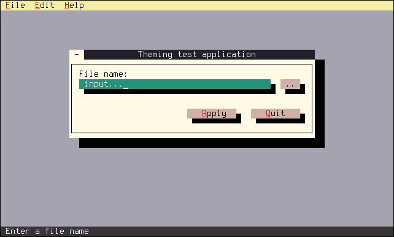

User Themes
===========

FINAL CUT supports color themes. That makes it possible to change the color 
of all elements of a widget in the program. Also, you can adjust the color 
palette to your preferences. If you want to switch back to the default 
themes, you can always call the method `FApplication::setDefaultTheme()` 
or `FApplication::setDarkTheme()` for the dark theme.


Widget Color Theme
------------------

FINAL CUT uses a default color scheme that the user can override in a 
derived class of `FWidgetColors`. All widget colors are redefined in the 
constructor by the method `setColorTheme()`.

```cpp
class myWidgetColors final : public finalcut::FWidgetColors
{
  public:
    myWidgetColors()
    {
      myWidgetColors::setColorTheme();
    }

    ~myWidgetColors() override
    { }

    auto getClassName() const -> finalcut::FString override
    {
      return "myWidgetColors";
    }

    void myWidgetColors() override
    {
      ...  // Color definitions
    }
};
```

For setting the widget colors, it is recommended to call the method 
`FWidget::setColorTheme()` via the `FApplication` object to create a 
new instance of the theme and assign it to the application.

```cpp
finalcut::FApplication app(argc, argv);
app.setColorTheme<myWidgetColors>();
```

In the following example, we will create the `BeeColorTheme`. For this 
purpose, we will first create an include file that can be easily included 
later in your application.

**File:** *widget-color-theme.h*
```cpp
#ifndef WIDGETCOLORTHEME_H
#define WIDGETCOLORTHEME_H

class BeeColorTheme final : public finalcut::FWidgetColors
{
  public:
    BeeColorTheme()
    {
      BeeColorTheme::setColorTheme();
    }

    ~BeeColorTheme() override
    { }

    auto getClassName() const -> finalcut::FString override
    {
      return "BeeColorTheme";
    }

    void setColorTheme() override
    {
      term =
      {
        finalcut::FColor::Black,      // Foreground
        finalcut::FColor::LightBlue   // Background
      };

      dialog =
      {
        finalcut::FColor::Black,      // Foreground
        finalcut::FColor::LightGray,  // Background
        finalcut::FColor::Red,        // Resize foreground
        finalcut::FColor::Blue        // Emphasis foreground
      };

      text =
      {
        finalcut::FColor::Black,      // Foreground
        finalcut::FColor::LightGray,  // Background
        finalcut::FColor::White,      // Selected foreground
        finalcut::FColor::Blue,       // Selected background
        finalcut::FColor::White,      // Selected focused foreground
        finalcut::FColor::Cyan        // Selected focused background
      };

      error_box =
      {
        finalcut::FColor::Black,      // Foreground
        finalcut::FColor::Yellow,     // Background
        finalcut::FColor::Red         // Emphasis foreground
      };

      tooltip =
      {
        finalcut::FColor::Black,      // Foreground
        finalcut::FColor::Yellow      // Background
      };

      shadow =
      {
        finalcut::FColor::LightGray,  // Foreground (only for transparent shadow)
        finalcut::FColor::Black       // Background
      };

      current_element =
      {
        finalcut::FColor::White,      // Foreground
        finalcut::FColor::Green,      // Background
        finalcut::FColor::LightGray,  // Focused foreground
        finalcut::FColor::DarkGray,   // Focused background
        finalcut::FColor::Brown,      // Incremental search foreground
        finalcut::FColor::LightRed,   // Selected foreground
        finalcut::FColor::Green,      // Selected background
        finalcut::FColor::LightRed,   // Selected focused foreground
        finalcut::FColor::DarkGray    // Selected focused background
      };

      list =
      {
        finalcut::FColor::Black,      // Foreground
        finalcut::FColor::LightGray,  // Background
        finalcut::FColor::LightRed,   // Selected foreground
        finalcut::FColor::LightGray   // Selected background
      };

      label =
      {
        finalcut::FColor::Black,      // Foreground
        finalcut::FColor::LightGray,  // Background
        finalcut::FColor::LightGray,  // Inactive foreground
        finalcut::FColor::DarkGray,   // Inactive background
        finalcut::FColor::Red,        // Hotkey foreground
        finalcut::FColor::LightGray,  // Hotkey background
        finalcut::FColor::Blue,       // Emphasis foreground
        finalcut::FColor::DarkGray    // Ellipsis foreground
      };

      input_field =
      {
        finalcut::FColor::Black,      // Foreground
        finalcut::FColor::Cyan,       // Background
        finalcut::FColor::LightGray,  // Focused foreground
        finalcut::FColor::Green,      // Focused background
        finalcut::FColor::Black,      // Inactive foreground
        finalcut::FColor::LightGray   // Inactive background
      };
    
      toggle_button =
      {
       finalcut::FColor::Black,       // Foreground
       finalcut::FColor::LightGray,   // Background
       finalcut::FColor::White,       // Focused foreground
       finalcut::FColor::Green,       // Focused background
       finalcut::FColor::DarkGray,    // Inactive foreground
       finalcut::FColor::LightGray    // Inactive background
      };

      button =
      {
        finalcut::FColor::Black,      // Foreground
        finalcut::FColor::Cyan,       // Background
        finalcut::FColor::White,      // Focused foreground
        finalcut::FColor::Green,      // Focused background
        finalcut::FColor::Cyan,       // Inactive foreground
        finalcut::FColor::LightGray,  // Inactive background
        finalcut::FColor::Red         // Hotkey foreground
      };

      titlebar =
      {
        finalcut::FColor::White,      // Foreground
        finalcut::FColor::Blue,       // Background
        finalcut::FColor::LightGray,  // Inactive foreground
        finalcut::FColor::DarkGray,   // Inactive background
        finalcut::FColor::Black,      // Button foreground
        finalcut::FColor::LightGray,  // Button background
        finalcut::FColor::LightGray,  // Focused button foreground
        finalcut::FColor::Black       // Focused button background
      };

      menu =
      {
        finalcut::FColor::Black,      // Foreground
        finalcut::FColor::Yellow,     // Background
        finalcut::FColor::White,      // Focused foreground
        finalcut::FColor::Blue,       // Focused background
        finalcut::FColor::Cyan,       // Inactive foreground
        finalcut::FColor::Yellow,     // Inactive background
        finalcut::FColor::Red,        // Hotkey foreground
        finalcut::FColor::Yellow      // Hotkey background
      };

      statusbar =
      {
        finalcut::FColor::White,      // Foreground
        finalcut::FColor::DarkGray,   // Background
        finalcut::FColor::White,      // Focused foreground
        finalcut::FColor::Green,      // Focused background
        finalcut::FColor::Black,      // Separator foreground
        finalcut::FColor::LightRed,   // Hotkey foreground
        finalcut::FColor::DarkGray,   // Hotkey background
        finalcut::FColor::LightRed,   // Focused hotkey foreground
        finalcut::FColor::Green       // Focused hotkey background
      };

      scrollbar =
      {
        finalcut::FColor::Black,      // Foreground
        finalcut::FColor::Green,      // Background
        finalcut::FColor::Black,      // Button foreground
        finalcut::FColor::Green,      // Button background
        finalcut::FColor::Cyan,       // Inactive button foreground
        finalcut::FColor::LightGray   // Inactive button background
      };

      progressbar =
      {
        finalcut::FColor::Green,      // Foreground
        finalcut::FColor::DarkGray    // Background
      };
    }
};

#endif  // WIDGETCOLORTHEME_H
```


Color Palette Theme
-------------------

FINAL CUT has four color tables for the 16 standard colors in the terminal. 
These are a redefinition of the 16 ANSI colors. You can address the colors 
via indexes values from 0 to 15. They correspond to the following colors:

| Index  | Color name                     |
|:------:|:-------------------------------|
|    0   | finalcut::FColor::Black        |
|    1   | finalcut::FColor::Blue         |
|    2   | finalcut::FColor::Green        |
|    3   | finalcut::FColor::Cyan         |
|    4   | finalcut::FColor::Red          |
|    5   | finalcut::FColor::Magenta      |
|    6   | finalcut::FColor::Brown        |
|    7   | finalcut::FColor::LightGray    |
|    8   | finalcut::FColor::DarkGray     |
|    9   | finalcut::FColor::LightBlue    |
|   10   | finalcut::FColor::LightGreen   |
|   11   | finalcut::FColor::LightCyan    |
|   12   | finalcut::FColor::LightRed     |
|   13   | finalcut::FColor::LightMagenta |
|   14   | finalcut::FColor::Yellow       |
|   15   | finalcut::FColor::White        |

You can define your color as an 8-bit value based on its red, green, and 
blue components. To create a color palette, create a derived class of 
`FColorPalette`. The constructor gets as argument the function to set 
a palette color. This function must have the following structure:

```cpp
setPalette(finalcut::FColor index, int red, int green, int blue);
```

A possible implementation could look as follows:

```cpp
class myColorPalette final : public finalcut::FColorPalette
{
  public:
    explicit myColorPalette (const FSetPalette& f)
      : FColorPalette(f)
    { }

    ~myColorPalette()
    { }

    auto getClassName() const -> finalcut::FString override
    {
      return "myColorPalette";
    }

    void setColorPalette() override
    {
      ...  // Palette definitions
    }

    void resetColorPalette() override
    {
      setVGAdefaultPalette();
    }
};
```
To set the colors of a palette theme, you should use the method 
`FOutput::setColorPaletteTheme()`. This method creates a new instance and 
saves it in the `FOutput` object.

```cpp
finalcut::FVTerm::getFOutput()->setColorPaletteTheme<myColorPalette>();
```
The standard VGA palette is part of the `FColorPalette` class. To set it, 
use the method `setVGAdefaultPalette()`. You can use it to reset the color 
palette of terminals that cannot reset to default values with escape 
sequences.
<figure class="image">
  
  <figcaption>Figure 1.  VGA palette</figcaption>
</figure>
<br /><br />

The FINAL CUT eight-color palette `default8ColorPalette` is optimized for 
the eight-color widget theme `default8ColorTheme`. It is for terminals 
that cannot display more than eight colors.
<figure class="image">
  
  <figcaption>Figure 2.  FINAL CUT 8-color palette</figcaption>
</figure>
<br /><br />

The FINAL CUT palette `default16ColorPalette` is the default 16-color 
palette. It is optimized for the widget color theme `default16ColorTheme`.
<figure class="image">
  
  <figcaption>Figure 3.  FINAL CUT 16-color palette</figcaption>
</figure>
<br /><br />

The second 16-color palette in FINAL CUT is for the dark theme. It was 
adjusted for the widget color themes `default8ColorDarkTheme` and 
`default16ColorDarkTheme`.
<figure class="image">
  
  <figcaption>Figure 4.  FINAL CUT 16-color dark palette</figcaption>
</figure>
<br /><br />

In the following example, we want to create the palette them 
`BeeColorPalette`. For this purpose, we generate an include file again, 
in which we implement the new palette class.
<figure class="image">
  
  <figcaption>Figure 6.  Bee palette</figcaption>
</figure>
<br /><br />

**File:** *color-palette-theme.h*
```cpp
#ifndef BEECOLORPALETTE_H
#define BEECOLORPALETTE_H

class BeeColorPalette final : public finalcut::FColorPalette
{
  public:
    explicit BeeColorPalette (const FSetPalette& f)
      : FColorPalette(f)
    { }

    ~BeeColorPalette()
    { }

    auto getClassName() const -> finalcut::FString override
    {
      return "BeeColorPalette";
    }

    void setColorPalette() override
    {
      setPalette (finalcut::FColor::Black, 0x00, 0x00, 0x00);
      setPalette (finalcut::FColor::Blue, 0x23, 0x21, 0x2c);
      setPalette (finalcut::FColor::Green, 0x26, 0x93, 0x7c);
      setPalette (finalcut::FColor::Cyan, 0xcf, 0xb3, 0xa8);
      setPalette (finalcut::FColor::Red, 0xba, 0x1a, 0x1a);
      setPalette (finalcut::FColor::Magenta, 0xb2, 0x18, 0xb2);
      setPalette (finalcut::FColor::Brown, 0xe8, 0x87, 0x1f);
      setPalette (finalcut::FColor::LightGray, 0xff, 0xfb, 0xe4);
      setPalette (finalcut::FColor::DarkGray, 0x3a, 0x36, 0x37);
      setPalette (finalcut::FColor::LightBlue, 0xa5, 0xa5, 0xb1);
      setPalette (finalcut::FColor::LightGreen, 0x5e, 0xeb, 0x5c);
      setPalette (finalcut::FColor::LightCyan, 0x62, 0xbf, 0xf8);
      setPalette (finalcut::FColor::LightRed, 0xee, 0x44, 0x44);
      setPalette (finalcut::FColor::LightMagenta, 0xe9, 0xad, 0xff);
      setPalette (finalcut::FColor::Yellow, 0xf8, 0xef, 0xa6);
      setPalette (finalcut::FColor::White, 0xff, 0xff, 0xff);
    }

    void resetColorPalette() override
    {
      setVGAdefaultPalette();
    }
};

#endif  // BEECOLORPALETTE_H
```


Use of Themes
-------------

If you include the two include files above in your application, you can use 
the widget color theme and the color palette theme. In the main function of 
your application, the object instances of both classes are created and set.
<figure class="image">
  
  <figcaption>Figure 7.  User theme example</figcaption>
</figure>
<br /><br />

**File:** *theme.cpp*
```cpp
#include <final/final.h>

#include "widget-color-theme.h"
#include "color-palette-theme.h"

using namespace finalcut;

class dialogWidget final : public FDialog
{
  public:
    explicit dialogWidget (FWidget* parent = nullptr)
      : FDialog{"Theming test application", parent}
    {
      Input.setLabelText("File name:");
      Input.setLabelOrientation(FLineEdit::LabelOrientation::Above);
      Input.setStatusbarMessage("Enter a file name");
      Browse.addCallback
      (
        "clicked",
        this, &dialogWidget::cb_FileBrowse
      );
      Apply.setStatusbarMessage("Apply settings");
      Quit.setStatusbarMessage("Exit the program");
      Quit.addCallback
      (
        "clicked",
        finalcut::getFApplication(),
        &finalcut::FApplication::cb_exitApp,
        this  
      );
      Open.addCallback
      (
        "clicked",
        this, &dialogWidget::cb_FileBrowse
      );
    }

  private:
    void initLayout()
    {
      setGeometry (FPoint{15, 5}, FSize{50, 9});
      Input.setGeometry (FPoint{2, 2}, FSize{39, 1});
      Browse.setGeometry (FPoint{43, 2}, FSize{4, 1});
      Apply.setGeometry (FPoint{24, 5}, FSize{10, 1});
      Quit.setGeometry (FPoint{37, 5}, FSize{10, 1});
      FDialog::initLayout();
    }

    void cb_FileBrowse()
    {
      auto filename = FFileDialog::fileOpenChooser(this);

      if ( ! filename.isEmpty() )
      {
        Input.setText(filename);
        Input.redraw();
      }
    }

    FMenuBar        Menubar{this};
    FMenu           File{"&File", &Menubar};
    FMenuItem       New{"&New", &File};
    FMenuItem       Open{"&Open...", &File};
    FMenu           Edit{"&Edit", &Menubar};
    FMenuItem       Undo{"&Undo", &Edit};
    FMenu           Help{"&Help", &Menubar};
    FMenuItem       About{"&About", &Help};
    FStatusBar      Statusbar{this};
    FLineEdit       Input{"input...", this};
    FButton         Browse{"..", this};
    FButton         Apply{"&Apply", this};
    FButton         Quit{"&Quit", this};
};

auto main (int argc, char* argv[]) -> int
{
  FApplication app(argc, argv);

  // Set the widget color theme
  app.setColorTheme<BeeColorTheme>();

  // Set the color palette theme
  FVTerm::getFOutput()->setColorPaletteTheme<BeeColorPalette>();

  dialogWidget dialog(&app);
  FWidget::setMainWidget(&dialog);
  dialog.show();
  return app.exec();
}
```


After entering the source code in *theme.cpp* you can compile
the above program with gcc:
```bash
g++ theme.cpp -o theme -O2 -lfinal -std=c++14
```

