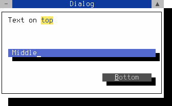

Widget layout
=============

Table of Contents
-----------------

<!-- TOC -->
- [Coordinates](#coordinates)
- [Lengths](#lengths)
- [Areas](#areas)
- [Dynamic layout](#dynamic-layout)
<!-- /TOC -->


Coordinates
-----------

The positioning of a widget in the terminal works via a coordinate 
system. It consists of _x_ characters in the horizontal and _y_ 
characters in the vertical. The upper left corner has the coordinates 
(1, 1). With the commands `getDesktopWidth()` and `getDesktopHeight()`, 
the width and height of the terminal get retrieved. These two values 
result in the position of the lower right terminal corner. The position 
of a widget is retrievable with `getX()`, `getY()`, and `getPos()` or 
is definable with `setX()`, `setY()`, and `setPos()`. The data type for 
each coordinate is an `int`. All positions represent an `FPoint` 
object. The positioning of the widget is always relative to its parent 
widget. The top parent widget in a chain of children contains the 
terminal desktop. There the absolute terminal positions are still 
identical to the relative positions (`getPos()` = `getTermPos()`). In 
the case of a child widget, the positioning is corresponding to the 
upper left corner of the parent widget plus a possible padding space 
(can be determined with `getLeftPadding()` and `getTopPadding()`). 
If you want to ignore padding spaces, you have to force this with the 
`ignorePadding()` method.

<figure class="image">
  
  <figcaption>Figure 11.  Widget coordinates</figcaption>
</figure>
<br /><br />

```cpp
int              getX() const;
int              getY() const;
const FPoint     getPos() const;
int              getTermX() const;
int              getTermY() const;
const FPoint     getTermPos() const;
virtual void     setX (int x, bool adjust = true);
virtual void     setY (int y, bool adjust = true);
virtual void     setPos (const FPoint& p, bool adjust = true);
```

If you set the value of `adjust` to `false` when calling `setX()`, 
`setY()`, or `setPos()`, this will prevent the explicit call of 
`adjustSize()` afterward.  This is important to avoid `adjustSize()` 
loops or to block the `adjustSize()` call from being repeated 
unnecessarily often.


Lengths
-------

The dimensions of a widget can be retrieved and defined separately in 
width and height. The methods `getWidth()` and `getHeight()` 
respectively `setWidth()` and `setHeight()` are used for this. Because 
a length cannot be negative, all lengths are of type `std::size_t`. 
The maximum size of a child widget automatically results from the size 
of the parent widget, which is retrievable with `getClientWidth()` and 
`getClientHeight()`. Some widgets have a border, a title bar, or both, 
which can reduce the maximum size of the child widget.

&#160;&#160;&#160;&#160;&#160;&#160;&#160;&#160;widget width ≥ client widget width<br />
&#160;&#160;&#160;&#160;&#160;&#160;&#160;&#160;widget height ≥ client widget height

Corresponding padding space ensures the correct distance here. The 
padding space can be retrieved separately for all four sides with 
the widget methods `getTopPadding()`, `getLeftPadding()`, 
`getBottomPadding()`, and `getRightPadding()`. You can set the 
required padding space for the widget using the `setTopPadding()`, 
`setLeftPadding()`, `setBottomPadding()` and `setRightPadding()` 
methods.

&#160;&#160;&#160;&#160;&#160;&#160;&#160;&#160;widget width = left padding + client width + right padding<br />
&#160;&#160;&#160;&#160;&#160;&#160;&#160;&#160;widget height = top padding + client height + bottom padding

<figure class="image">
  
  <figcaption>Figure 12.  Width and height of a widget</figcaption>
</figure>
<br /><br />


```cpp
std::size_t    getWidth() const;
std::size_t    getHeight() const;
std::size_t    getClientWidth() const;
std::size_t    getClientHeight() const;
int            getTopPadding() const;
int            getLeftPadding() const;
int            getBottomPadding() const;
int            getRightPadding() const;
virtual void   setWidth (std::size_t width, bool adjust = true);
virtual void   setHeight (std::size_t height, bool adjust = true);
void           setTopPadding (int top, bool adjust = true);
void           setLeftPadding (int left, bool adjust = true);
void           setBottomPadding (int bottom, bool adjust = true);
void           setRightPadding (int right, bool adjust = true);
```

If the value of `adjust` is set to `false` for `setWidth()`, 
`setHeight()`, `setTopPadding()`, `setLeftPadding()`, 
`setBottomPadding()` or `setRightPadding()`, then `adjustSize()` is 
not explicitly called afterward. This is important to prevent 
`adjustSize()` loops or to avoid that `adjustSize()` is called 
unnecessarily often.


Areas
-----

The terminal area in which a widget appears determines its geometry. 
The geometry of a widget is composed of its position and its size. 
A widget position is always of object type `FPoint` and a widget 
size of type `FSize`. The widget geometry can be retrieved as `FRect`
object via the widget method `getGeometry()` and set with the method 
`setGeometry()`. The `getTermGeometry()` method gets the total values 
of the terminal geometry.
If you are only interested in the size of a widget, you can also use 
the method `getSize()`. To set the widget size, you can use the method 
`setSize()`.
The position of a shadow is outside the widget. The shadow size itself 
as `FSize` object is retrievable via the `getShadow()` method. You 
can set the widget shadow size with the `setShadowSize()` method. If 
you want to get the geometry values of a widget, including its shadow, 
you can use the method `getGeometryWithShadow()` from the FWidget 
class. If you want to have the entire geometry with shadow for the 
absolute geometry values as a `FRect` object, you can call the method 
`getTermGeometryWithShadow()`.

<figure class="image">
  
  <figcaption>Figure 13.  Geometry of widgets</figcaption>
</figure>
<br /><br />

```cpp
const FSize    getSize() const;
const FSize    getClientSize() const;
const FRect&   getGeometry() const;
const FRect&   getTermGeometry();
const FSize&   getShadow() const;
const FRect&   getGeometryWithShadow();
const FRect&   getTermGeometryWithShadow();
virtual void   setSize (const FSize& size, bool adjust = true);
virtual void   setGeometry (const FRect& box, bool adjust = true);
virtual void   setGeometry (const FPoint& p, const FSize& s, bool adjust = true);
virtual void   setShadowSize (const FSize& size);
```

If you explicitly set the value of `adjust` to `false` when 
using the `setSize()`, `setGeometry()` or `setShadowSize()` 
mutators, the `adjustSize()` method is no longer called automatically. 
This can be used to prevent recursive `adjustSize()` calls or to 
avoid unnecessary `adjustSize()` calls.


Dynamic layout
--------------

A modern terminal emulation like xterm has no fixed resolution. 
They offer the possibility to change the height and width of the 
terminal at any time. That triggers a resize-event that calls 
the `adjustSize()` method. This method allows adapting the widget 
to a changed terminal size. You can override the `adjustSize()` 
method to adjust the size and position of the widget. The method 
`adjustSize()` will also be called indirectly via calling methods 
`setGeometry()`, `setX()`, `setY()`, `setPos()`, `setWidth()`, 
`setHeight()`, `setSize()`, `setTopPadding()`, `setLeftPadding()`, 
`setBottomPadding()`, `setRightPadding()`, or `setDoubleFlatLine()`.

Scalable dialogs derived from FDialog can change the dialog size by 
clicking on the lower right corner of the window.  You can intercept 
a scaling action by overriding the `setSize()` method and adjusting 
the client widgets.

**File:** *size-adjustment.cpp*
```cpp
#include <final/final.h>

using namespace finalcut;

class dialogWidget : public FDialog
{
  public:
    explicit dialogWidget (FWidget* parent = nullptr)
      : FDialog{parent}
    { }

  private:
    void initLayout()
    {
      setText ("Dialog");
      setResizeable();
      button.setGeometry (FPoint{1, 1}, FSize{12, 1}, false);
      input.setGeometry (FPoint{2, 3}, FSize{12, 1}, false);
      // Set dialog geometry and calling adjustSize()
      setGeometry (FPoint{25, 5}, FSize{40, 12});
      setMinimumSize (FSize{25, 9});
      FDialog::initLayout();
    }

    inline void checkMinValue (int& n)
    {
      if ( n < 1 )  // Checks and corrects the minimum value
        n = 1;
    }

    void centerDialog()
    {
      auto x = int((getDesktopWidth() - getWidth()) / 2);
      auto y = int((getDesktopHeight() - getHeight()) / 2);
      checkMinValue(x);
      checkMinValue(y);
      setPos (FPoint{x, y}, false);
    }

    void adjustWidgets()
    {
      const auto bx = int(getWidth() - button.getWidth() - 3);
      const auto by = int(getHeight() - 4);
      button.setPos (FPoint{bx, by}, false);
      input.setWidth (getWidth() - 4);
      const auto ly = int(getHeight() / 2) - 1;
      input.setY (ly, false);
    }

    void adjustSize() override
    {
      // Calling super class method adjustSize()
      FDialog::adjustSize();
      // Centers the dialog in the terminal
      centerDialog();
      // Adjust widgets before drawing
      adjustWidgets();
    }

    void draw() override
    {
      // Calling super class method draw()
      FDialog::draw();

      print() << FPoint{3, 3}
              << FColorPair{FColor::Black, FColor::White}
              << "Text on "
              << FColorPair{FColor::Blue, FColor::Yellow}
              << "top";
    }

    FLineEdit input{"Middle", this};
    FButton button{"&Bottom", this};
};

auto main (int argc, char* argv[]) -> int
{
  FApplication app(argc, argv);
  dialogWidget dialog(&app);
  FWidget::setMainWidget(&dialog);
  dialog.show();
  return app.exec();
}
```
<figure class="image">
  
  <figcaption>Figure 14.  Dynamic layout</figcaption>
</figure>
<br /><br />

> [!NOTE]
> You can close the dialog with the mouse, 
> <kbd>Shift</kbd>+<kbd>F10</kbd> or <kbd>Ctrl</kbd>+<kbd>^</kbd>


After entering the source code in *size-adjustment.cpp* you can compile
the above program with gcc:
```bash
g++ size-adjustment.cpp -o size-adjustment -O2 -lfinal -std=c++14
```
