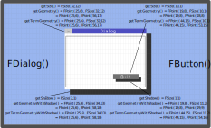
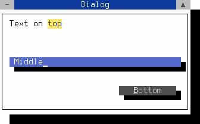

Widget Layout
=============

Table of Contents
-----------------

<!-- toc -->
- [Coordinates](#coordinates)
- [Lengths](#lengths)
- [Regions](#regions)
- [Dynamic layout](#dynamic-layout)
<!-- endtoc -->


Coordinates
-----------

Widgets are positioned in the terminal using a coordinate system. 
It spans _x_ characters horizontally and _y_ characters vertically. 
The top-left corner is at coordinates (1, 1). The `getDesktopWidth()` 
and `getDesktopHeight()` commands return the terminal's width and 
height. These two values define the position of the lower-right corner 
of the terminal. You can retrieve the position of a widget using 
`getX()`, `getY()`, and `getPos()`, or set it using `setX()`, 
`setY()`, and `setPos()`. Each coordinate is an `int`, and positions 
are represented by `FPoint` objects. Widgets are always 
positioned relative to their parent. The top parent widget in a 
parent-child chain contains the terminal desktop, where absolute and 
relative positions are identical (`getPos()` == `getTermPos()`). 
Child widget positions are relative to the parent's top-left corner, 
plus optional padding (`getLeftPadding()` and `getTopPadding()`). 
If you want to ignore padding spaces, you can do so using the 
`ignorePadding()` method.

<figure class="image">
  
  <figcaption>Figure 1:  Widget coordinates</figcaption>
</figure>
<br /><br />

```cpp
int              getX() const;
int              getY() const;
const FPoint     getPos() const;
int              getTermX() const;
int              getTermY() const;
const FPoint     getTermPos() const;
virtual void     setX (int x, bool adjust = true);
virtual void     setY (int y, bool adjust = true);
virtual void     setPos (const FPoint& p, bool adjust = true);
```

Set `adjust` to `false` when calling `setX()`, `setY()`, or `setPos()`
to prevent an explicit call to `adjustSize()`. This avoids loops and 
redundant execution.


Dimensions
----------

A widget's width and height can be retrieved and set independently.
The `getWidth()` and `getHeight()` methods—as well as their 
corresponding `setWidth()` and `setHeight()` methods—are used for 
this. All Dimensions are of type `std::size_t` because a Dimension 
cannot be negative. The parent widget's size automatically limits 
the maximum size of a child widget. Retrieve it using 
`getClientWidth()` and `getClientHeight()`. Some widgets have a 
border, a title bar, or both, thereby reducing the maximum size of 
the child widget.

<blockquote>
widget_width ≥ client_widget_width<br />
widget_height ≥ client_widget_height
</blockquote>

Padding provides the required spacing. Use `getTopPadding()`, 
`getLeftPadding()`, `getBottomPadding()`, and `getRightPadding()` to 
retrieve the padding for each of the four sides individually. 
You can set the padding in the same way by calling `setTopPadding()`, 
`setLeftPadding()`, `setBottomPadding()`, or `setRightPadding()`.

<blockquote>
widget_width = left_padding + client_width + right_padding<br />
widget_height = top_padding + client_height + bottom_padding
</blockquote>

<figure class="image">
  
  <figcaption>Figure 2:  Width and height of a widget</figcaption>
</figure>
<br /><br />


```cpp
std::size_t    getWidth() const;
std::size_t    getHeight() const;
std::size_t    getClientWidth() const;
std::size_t    getClientHeight() const;
int            getTopPadding() const;
int            getLeftPadding() const;
int            getBottomPadding() const;
int            getRightPadding() const;
virtual void   setWidth (std::size_t width, bool adjust = true);
virtual void   setHeight (std::size_t height, bool adjust = true);
void           setTopPadding (int top, bool adjust = true);
void           setLeftPadding (int left, bool adjust = true);
void           setBottomPadding (int bottom, bool adjust = true);
void           setRightPadding (int right, bool adjust = true);
```

If the `adjust` argument is set to `false` when calling `setWidth()`, 
`setHeight()`, `setTopPadding()`, `setLeftPadding()`, 
`setBottomPadding()`, or `setRightPadding()`, `adjustSize()` is not 
called. This prevents `adjustSize()` loops and avoids redundant calls.


Regions
-------

A widget's geometry specifies the region where it is displayed on the 
terminal. A widget's geometry comprises an `FPoint` position and an 
`FSize` size. You can manage this geometry as an `FRect` object with 
`getGeometry()` and `setGeometry()`. To get the global terminal 
geometry, use `getTermGeometry()`. Use `getSize()` and `setSize()` 
to retrieve and set the widget's size alone.

Shadows are rendered outside the widget. Retrieve the shadow size as 
an `FSize` object using `getShadow()`, and update it with 
`setShadowSize()`. Use the FWidget method `getGeometryWithShadow()` 
to get a widget's geometry, including its shadow. To retrieve the 
absolutely positioned geometry, use `getTermGeometryWithShadow()`.

<figure class="image">
  
  <figcaption>Figure 3:  Geometry of widgets</figcaption>
</figure>
<br /><br />

```cpp
const FSize    getSize() const;
const FSize    getClientSize() const;
const FRect&   getGeometry() const;
const FRect&   getTermGeometry();
const FSize&   getShadow() const;
const FRect&   getGeometryWithShadow();
const FRect&   getTermGeometryWithShadow();
virtual void   setSize (const FSize& size, bool adjust = true);
virtual void   setGeometry (const FRect& box, bool adjust = true);
virtual void   setGeometry (const FPoint& p, const FSize& s, bool adjust = true);
virtual void   setShadowSize (const FSize& size);
```

Setting the `adjust` argument to `false` in `setSize()`, 
`setGeometry()`, or `setShadowSize()` prevents `adjustSize()` from 
being called automatically. This can be used to avoid recursive 
`adjustSize()` calls or to avoid redundant `adjustSize()` calls.


Dynamic layout
--------------

A modern terminal emulator like xterm has no fixed resolution. 
You can change the terminal's height and width at any time. This
triggers a resize event that calls the `adjustSize()` method, which
automatically adapts the widget to the new terminal size. You 
can override the `adjustSize()` method to adjust the size and position 
of the widget.

The following geometry-setting methods also trigger `adjustSize()` 
indirectly:

| Position and Size | Padding                | Merging Borders       |
|-------------------|------------------------|-----------------------|
| `setGeometry()`   | `setTopPadding()`      | `setMergingBorder()`  |
| `setX()`          | `setLeftPadding()`     |                       |
| `setY()`          | `setBottomPadding()`   |                       |
| `setPos()`        | `setRightPadding()`    |                       |
| `setWidth()`      |                        |                       |
| `setHeight()`     |                        |                       |
| `setSize()`       |                        |                       |


For scalable windows derived from `FDialog`, users can resize the 
dialog by clicking on the bottom-right corner of the window. You can 
intercept a scaling action by overriding the `setSize()` method and 
adjusting the client widgets.

**File:** *size-adjustment.cpp*
```cpp
#include <final/final.h>

using namespace finalcut;

class DialogWidget : public FDialog
{
  public:
    explicit DialogWidget (FWidget* parent = nullptr)
      : FDialog{parent}
    { }

  private:
    void initLayout()
    {
      setText ("Dialog");
      setResizable();
      button.setGeometry (FPoint{1, 1}, FSize{12, 1}, false);
      input.setGeometry (FPoint{2, 3}, FSize{12, 1}, false);
      // Set dialog geometry and call adjustSize()
      setGeometry (FPoint{25, 5}, FSize{40, 12});
      setMinimumSize (FSize{25, 9});
      FDialog::initLayout();
    }

    inline void checkMinValue (int& n)
    {
      if ( n < 1 )  // Checks and corrects the minimum value
        n = 1;
    }

    void centerDialog()
    {
      auto x = int((getDesktopWidth() - getWidth()) / 2);
      auto y = int((getDesktopHeight() - getHeight()) / 2);
      checkMinValue(x);
      checkMinValue(y);
      setPos (FPoint{x, y}, false);
    }

    void adjustWidgets()
    {
      const auto bx = int(getWidth() - button.getWidth() - 3);
      const auto by = int(getHeight() - 4);
      button.setPos (FPoint{bx, by}, false);
      input.setWidth (getWidth() - 4);
      const auto ly = int(getHeight() / 2) - 1;
      input.setY (ly, false);
    }

    void adjustSize() override
    {
      // Calling super class method adjustSize()
      FDialog::adjustSize();
      // Centers the dialog in the terminal
      centerDialog();
      // Adjust widgets before drawing
      adjustWidgets();
    }

    void draw() override
    {
      // Calling super class method draw()
      FDialog::draw();

      print() << FPoint{3, 3}
              << FColorPair{FColor::Black, FColor::White}
              << "Text on "
              << FColorPair{FColor::Blue, FColor::Yellow}
              << "top";
    }

    FLineEdit input{"Middle", this};
    FButton button{"&Bottom", this};
};

auto main (int argc, char* argv[]) -> int
{
  FApplication app(argc, argv);
  DialogWidget dialog(&app);
  FWidget::setMainWidget(&dialog);
  dialog.show();
  return app.exec();
}
```
<figure class="image">
  
  <figcaption>Figure 4:  Dynamic layout</figcaption>
</figure>
<br /><br />

> [!NOTE]
> To close the dialog, use the mouse or press 
> <kbd>Shift</kbd>+<kbd>F10</kbd> or <kbd>Ctrl</kbd>+<kbd>^</kbd>


Save the code as *size-adjustment.cpp* and compile it using the 
following command:
```bash
c++ size-adjustment.cpp -o size-adjustment -O2 -lfinal -std=c++14
```
